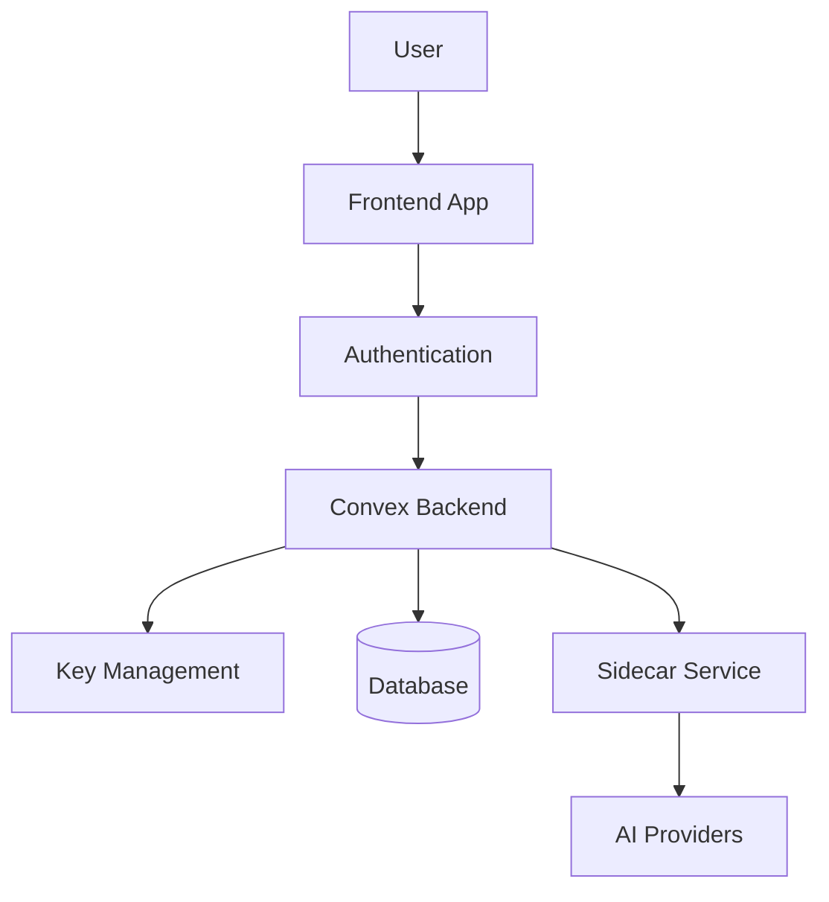

# Threat Model: Envelope Encryption Service

## Executive Summary

This document provides a comprehensive threat model for the OpenAgent Envelope Encryption Service, identifying potential security threats, attack vectors, and mitigation strategies. The service handles sensitive API keys and credentials using envelope encryption with AES-256-GCM and ECDH key exchange protocols.

## System Overview

### Architecture Components

1. **Frontend Application** - React-based web interface
2. **Convex Backend** - Serverless backend handling encryption operations
3. **Sidecar Service** - Local agent managing provider keys
4. **Database** - Stores encrypted keys and metadata
5. **Key Management System** - Master key storage and rotation

### Data Flow



## Trust Boundaries

### TB1: User to Frontend
- **Description**: Browser-to-application boundary
- **Crossed by**: User credentials, provider keys
- **Protection**: HTTPS, CSP headers, input validation

### TB2: Frontend to Backend
- **Description**: Client-server API boundary  
- **Crossed by**: API requests, encrypted keys
- **Protection**: JWT authentication, CSRF tokens, rate limiting

### TB3: Backend to Database
- **Description**: Application-to-storage boundary
- **Crossed by**: Encrypted keys, user data
- **Protection**: Envelope encryption, access controls

### TB4: Backend to Sidecar
- **Description**: Orchestrator-to-agent boundary
- **Crossed by**: Provider keys via ECDH exchange
- **Protection**: Ephemeral keys, sealed box encryption

### TB5: Sidecar to External Providers
- **Description**: Agent-to-API boundary
- **Crossed by**: Decrypted API keys
- **Protection**: TLS, short-lived sessions

## Threat Analysis

### STRIDE Classification

#### 1. Spoofing Identity

**T1.1: User Impersonation**
- **Attack**: Attacker obtains user's authentication tokens
- **Impact**: Unauthorized access to user's encrypted keys
- **Likelihood**: Medium
- **Mitigation**: 
  - Short-lived JWT tokens (15 min expiry)
  - Refresh token rotation
  - Device fingerprinting
  - MFA enforcement

**T1.2: Sidecar Impersonation**
- **Attack**: Malicious sidecar registers with stolen credentials
- **Impact**: Key exfiltration to unauthorized agent
- **Likelihood**: Low
- **Mitigation**:
  - ECDH key exchange validation
  - Session token verification
  - Mutual TLS authentication

#### 2. Tampering with Data

**T2.1: Encrypted Key Modification**
- **Attack**: Attacker modifies encrypted key in database
- **Impact**: Decryption failure, service disruption
- **Likelihood**: Very Low
- **Mitigation**:
  - AES-GCM authentication tags
  - Database access controls
  - Audit logging

**T2.2: Key Rotation Manipulation**
- **Attack**: Attacker interferes with key rotation process
- **Impact**: Old keys remain active, compliance violation
- **Likelihood**: Low
- **Mitigation**:
  - Atomic rotation transactions
  - Version tracking
  - Rollback capabilities

#### 3. Repudiation

**T3.1: Unauthorized Key Access Denial**
- **Attack**: User denies accessing/modifying keys
- **Impact**: Compliance issues, dispute resolution
- **Likelihood**: Low
- **Mitigation**:
  - Comprehensive audit logging
  - Tamper-evident logs
  - Log retention policies

#### 4. Information Disclosure

**T4.1: Database Breach**
- **Attack**: Attacker gains database access
- **Impact**: Encrypted keys exposed (but not plaintext)
- **Likelihood**: Medium
- **Mitigation**:
  - Envelope encryption
  - Database encryption at rest
  - Network isolation

**T4.2: Memory Scraping**
- **Attack**: Attacker reads process memory for keys
- **Impact**: Plaintext key exposure
- **Likelihood**: Low
- **Mitigation**:
  - SecureBuffer implementation
  - Memory zeroing after use
  - Process isolation

**T4.3: Side-Channel Attacks**
- **Attack**: Timing analysis, power analysis
- **Impact**: Key material leakage
- **Likelihood**: Very Low
- **Mitigation**:
  - Constant-time comparisons
  - Random delays
  - Hardware security modules

#### 5. Denial of Service

**T5.1: API Rate Limit Exhaustion**
- **Attack**: Flood requests to exhaust rate limits
- **Impact**: Service unavailability
- **Likelihood**: High
- **Mitigation**:
  - Per-user rate limiting
  - Exponential backoff
  - DDoS protection

**T5.2: Encryption Operation Overload**
- **Attack**: Request computationally expensive operations
- **Impact**: Resource exhaustion
- **Likelihood**: Medium
- **Mitigation**:
  - Operation queuing
  - Resource quotas
  - Async processing

#### 6. Elevation of Privilege

**T6.1: Privilege Escalation via Parameter Pollution**
- **Attack**: Manipulate request parameters to access other users' keys
- **Impact**: Cross-user data access
- **Likelihood**: Low
- **Mitigation**:
  - Strict input validation
  - Parameter binding
  - Authorization checks

**T6.2: Admin Function Access**
- **Attack**: Regular user accesses admin-only functions
- **Impact**: System-wide key compromise
- **Likelihood**: Very Low
- **Mitigation**:
  - Role-based access control
  - Function-level authorization
  - Admin action auditing

## Attack Vectors

### AV1: Authentication Bypass
```
Attack Path: Login endpoint → JWT manipulation → Backend access
Mitigation: Strong JWT validation, signature verification
```

### AV2: SQL/NoSQL Injection
```
Attack Path: Provider name input → Database query → Data exfiltration
Mitigation: Parameterized queries, input sanitization
```

### AV3: Cross-Site Scripting (XSS)
```
Attack Path: Key description → Stored XSS → Session hijacking
Mitigation: Output encoding, CSP headers, input validation
```

### AV4: Man-in-the-Middle
```
Attack Path: Sidecar registration → ECDH intercept → Key compromise
Mitigation: Certificate pinning, mutual TLS
```

### AV5: Cryptographic Weaknesses
```
Attack Path: Weak random numbers → Predictable nonces → Decryption
Mitigation: Crypto.getRandomValues(), hardware RNG
```

## Risk Assessment Matrix

| Threat | Likelihood | Impact | Risk Level | Priority |
|--------|------------|---------|------------|----------|
| T1.1 User Impersonation | Medium | High | High | P1 |
| T4.1 Database Breach | Medium | High | High | P1 |
| T5.1 Rate Limit DoS | High | Medium | High | P1 |
| T1.2 Sidecar Impersonation | Low | High | Medium | P2 |
| T2.1 Key Tampering | Very Low | High | Medium | P2 |
| T4.2 Memory Scraping | Low | High | Medium | P2 |
| T5.2 Crypto Overload | Medium | Medium | Medium | P2 |
| T6.1 Privilege Escalation | Low | High | Medium | P2 |
| T3.1 Repudiation | Low | Low | Low | P3 |
| T4.3 Side-Channel | Very Low | Medium | Low | P3 |
| T6.2 Admin Access | Very Low | Very High | Low | P3 |

## Security Controls

### Preventive Controls

1. **Encryption**
   - AES-256-GCM for data encryption
   - ECDH P-256 for key exchange
   - Envelope encryption for key storage

2. **Authentication & Authorization**
   - OAuth 2.0 / OpenID Connect
   - JWT with short expiry
   - RBAC implementation

3. **Input Validation**
   - Schema validation (Convex validators)
   - Regex patterns for provider names
   - Length limits on all inputs

4. **Rate Limiting**
   - Per-user operation limits
   - Exponential backoff
   - IP-based throttling

### Detective Controls

1. **Monitoring**
   - Failed authentication attempts
   - Unusual access patterns
   - Rate limit violations
   - Key rotation failures

2. **Audit Logging**
   - All key operations
   - Authentication events
   - Administrative actions
   - System errors

3. **Alerting**
   - Real-time security alerts
   - Threshold-based notifications
   - Anomaly detection

### Corrective Controls

1. **Incident Response**
   - Automated key rotation on breach
   - Session invalidation
   - Account lockout procedures

2. **Backup & Recovery**
   - Encrypted backups
   - Point-in-time recovery
   - Disaster recovery plan

## Compliance Considerations

### GDPR Requirements
- Data encryption at rest and in transit
- Right to erasure implementation
- Data processing audit trail
- Cross-border transfer controls

### SOC 2 Type II
- Access control procedures
- Change management process
- Vulnerability management
- Business continuity planning

### HIPAA (if applicable)
- Encryption standards (FIPS 140-2)
- Access logging and monitoring
- Data integrity controls
- Breach notification procedures

## Security Testing Requirements

### Static Analysis
- Code vulnerability scanning
- Dependency checking
- Secret detection

### Dynamic Testing
- Penetration testing quarterly
- Vulnerability assessments
- Security regression testing

### Cryptographic Validation
- NIST test vectors
- Key generation entropy
- Algorithm implementation review

## Incident Response Plan

### Severity Levels

**P0 - Critical**: Active exploitation, data breach
- Response time: < 15 minutes
- Escalation: Immediate

**P1 - High**: Vulnerability discovered, potential breach
- Response time: < 1 hour
- Escalation: Within 2 hours

**P2 - Medium**: Security misconfiguration, failed controls
- Response time: < 4 hours  
- Escalation: Within 24 hours

**P3 - Low**: Policy violations, minor issues
- Response time: < 24 hours
- Escalation: Weekly review

### Response Procedures

1. **Detection & Analysis**
   - Alert validation
   - Impact assessment
   - Evidence collection

2. **Containment**
   - Isolate affected systems
   - Disable compromised accounts
   - Rotate affected keys

3. **Eradication**
   - Remove malicious code
   - Patch vulnerabilities
   - Update security controls

4. **Recovery**
   - Restore from backups
   - Verify system integrity
   - Resume normal operations

5. **Post-Incident**
   - Root cause analysis
   - Lessons learned
   - Control improvements

## Recommendations

### Immediate Actions (P1)
1. Implement comprehensive input validation
2. Add rate limiting to all endpoints
3. Enable audit logging for all operations
4. Deploy monitoring and alerting

### Short-term (P2)
1. Implement hardware security module (HSM)
2. Add automated security testing
3. Enhance memory protection
4. Implement anomaly detection

### Long-term (P3)
1. Achieve compliance certifications
2. Implement zero-trust architecture
3. Add homomorphic encryption
4. Deploy security orchestration

## Appendices

### A. Attack Tree Diagrams
[Detailed attack trees for each threat vector]

### B. Data Classification
- **Critical**: Master keys, provider keys
- **Sensitive**: User data, session tokens
- **Internal**: System configuration, logs
- **Public**: Documentation, schemas

### C. Security Checklist
- [ ] All inputs validated
- [ ] Authentication required
- [ ] Authorization checked
- [ ] Encryption implemented
- [ ] Logging enabled
- [ ] Rate limits configured
- [ ] Error handling secure
- [ ] Dependencies updated
- [ ] Security headers set
- [ ] Tests passing

## Document Control

- **Version**: 1.0
- **Date**: September 2024
- **Classification**: Confidential
- **Review Cycle**: Quarterly
- **Next Review**: December 2024

---

*This threat model should be reviewed and updated whenever significant changes are made to the system architecture, after security incidents, or at minimum quarterly.*