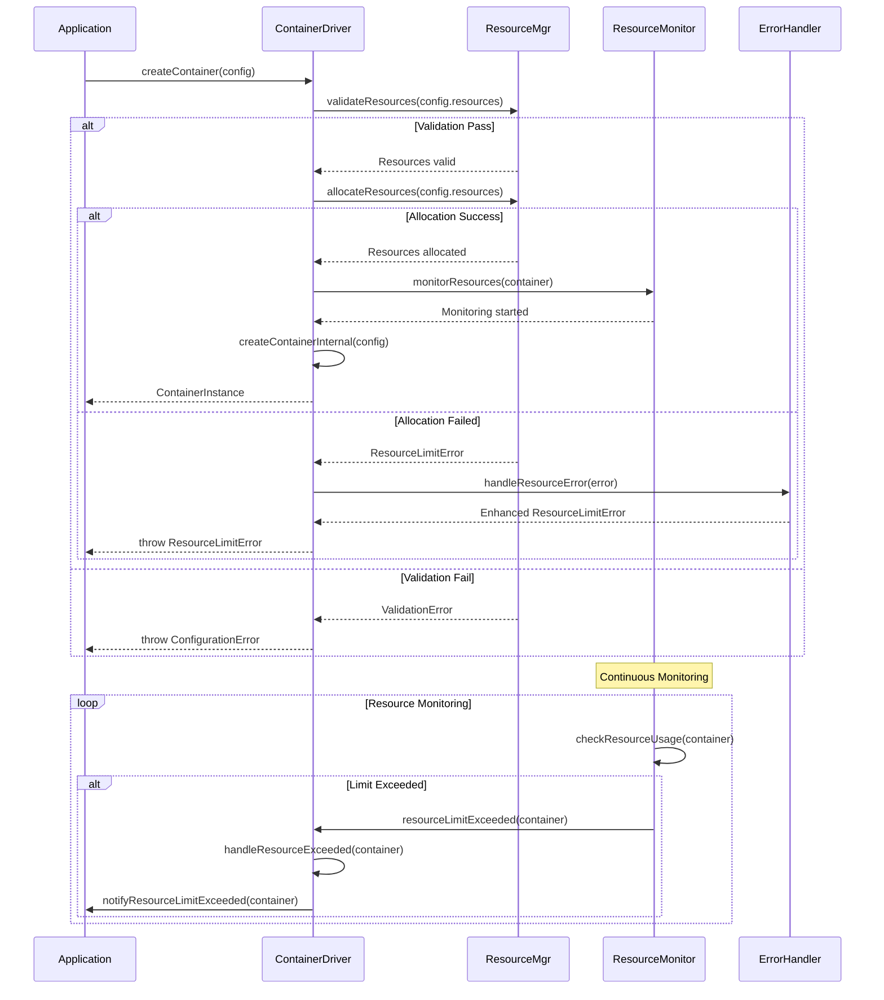

# Error Handling Flow Diagrams

## Overview

This document provides comprehensive error handling flow diagrams for the Driver Interface package, demonstrating how errors are handled, recovered from, and managed throughout the container lifecycle.

## Core Error Handling Architecture

### 1. Error Hierarchy and Classification


### 2. Error Classification Flow


## Container Lifecycle Error Handling

### 3. Container Creation Error Flow


### 4. Container Start Error Flow


## Retry Logic Implementation

### 5. Retry Strategy Flow


### 6. Exponential Backoff Algorithm

```mermaid
flowchart LR
    Error[Error Occurred] --> RetryCount[Current Retry Count]
    RetryCount --> BaseDelay[Base Delay: 100ms]
    BaseDelay --> Exponent[Exponent: Retry Count]
    Exponent --> Calculate[Calculate: BaseDelay * (2^Exponent)]
    Calculate --> MaxDelay{Exceeds Max Delay?}
    MaxDelay -->|Yes| Cap[Cap at Max Delay]
    MaxDelay -->|No| UseDelay[Use Calculated Delay]
    Cap --> Jitter[Add Random Jitter]
    UseDelay --> Jitter

    Jitter --> Wait[Wait for Delay]
    Wait --> Retry[Retry Operation]

    Retry --> Success{Success?}
    Success -->|Yes| Complete[Operation Complete]
    Success -->|No| Increment[Increment Retry Count]
    Increment --> MaxRetries{Max Retries Reached?}
    MaxRetries -->|No| Error
    MaxRetries -->|Yes| Failed[Final Failure]

    style Calculate fill:#e3f2fd,stroke:#2196f3,stroke-width:2px
    style Jitter fill:#f3e5f5,stroke:#9c27b0,stroke-width:2px
    style Complete fill:#e8f5e8,stroke:#4caf50,stroke-width:2px
```

## Circuit Breaker Pattern

### 7. Circuit Breaker State Machine


### 8. Circuit Breaker Implementation Flow


## Resource Management Error Handling

### 9. Resource Limit Error Flow



### 10. Resource Cleanup Error Flow


## Error Recovery Strategies

### 11. Error Recovery Decision Tree


### 12. Error Notification and Logging Flow


## Cross-Driver Error Handling

### 13. Driver-Specific Error Handling


### 14. Error Handling Consistency Across Drivers


## Error Prevention and Validation

### 15. Configuration Validation Flow


### 16. Health Check Error Handling


## Summary

The Driver Interface package implements a comprehensive error handling system with:

1. **Hierarchical Error Classification**: Organized error types with specific error codes and retry policies
2. **Retry Logic**: Exponential backoff with jitter and configurable retry limits
3. **Circuit Breaker Pattern**: Prevents cascading failures with automatic recovery
4. **Resource Management**: Proper resource allocation, monitoring, and cleanup
5. **Cross-Driver Consistency**: Standardized error handling across different driver implementations
6. **Error Prevention**: Proactive validation and health checking
7. **Recovery Strategies**: Multiple recovery approaches based on error severity and type

These error handling flows ensure robust operation, graceful degradation, and reliable resource management in container orchestration scenarios.