# Implementation Architecture Diagrams

## Overview

This document provides comprehensive implementation architecture diagrams for the Driver Interface package, showing the detailed structure, data flow, and interactions between components at the implementation level.

## System Architecture Overview

### 1. High-Level System Architecture

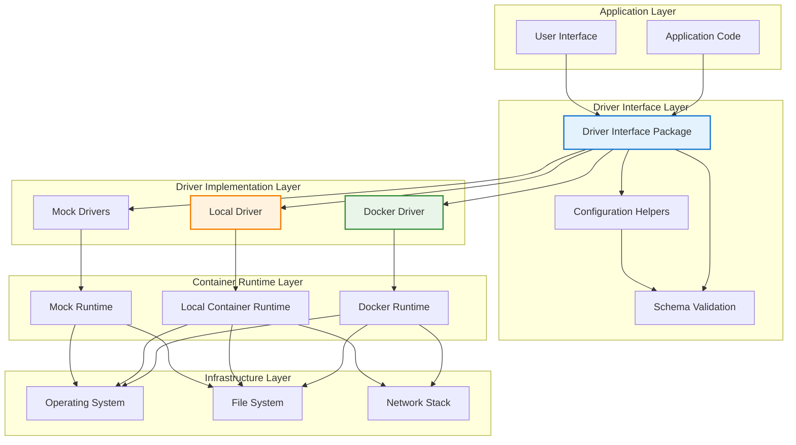

### 2. Package Internal Architecture

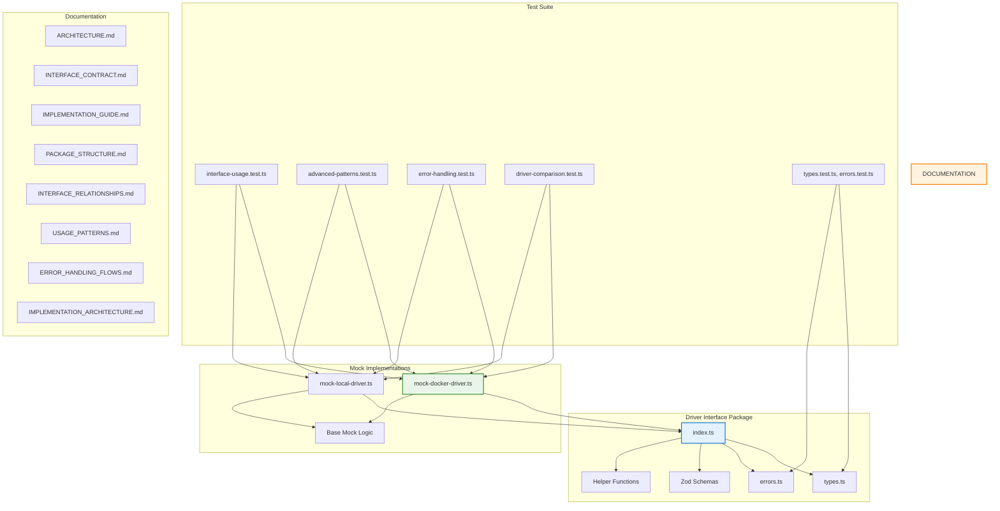

## Detailed Component Architecture

### 3. ContainerDriver Interface Implementation

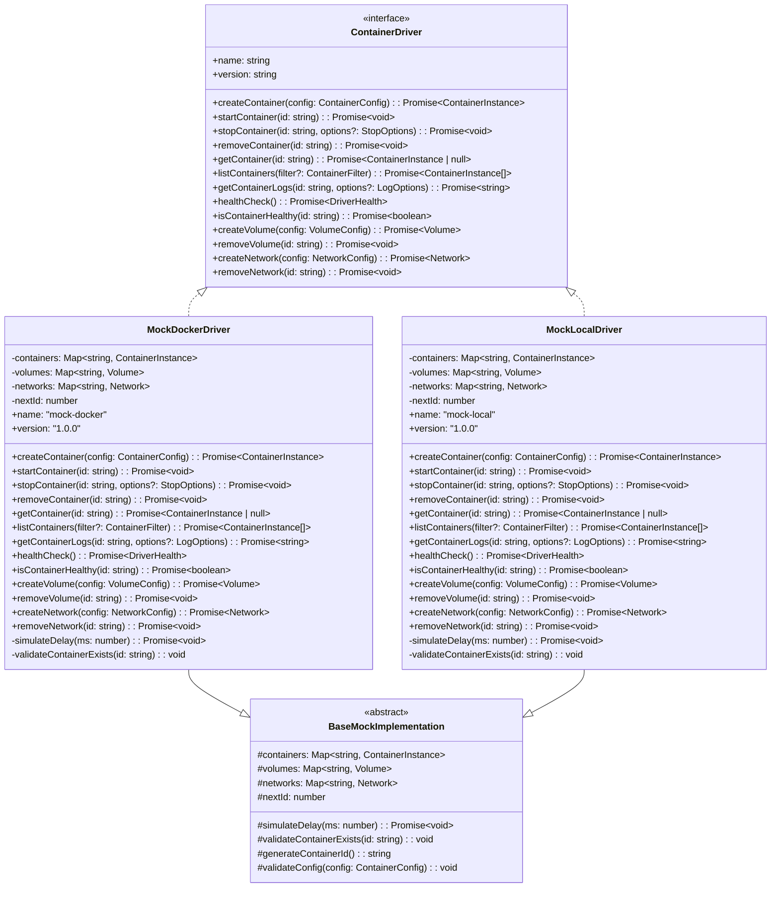

### 4. Type System Implementation Architecture

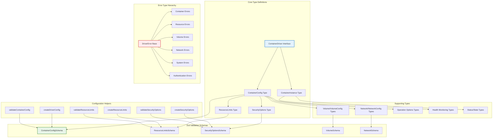

## Data Flow Architecture

### 5. Container Lifecycle Data Flow

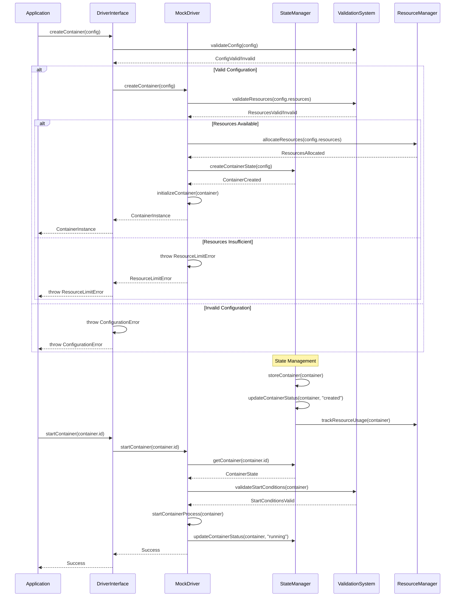

### 6. Error Handling Data Flow

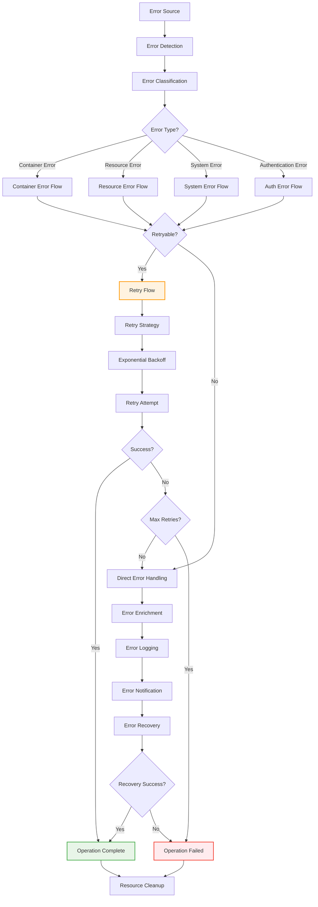

## Mock Implementation Architecture

### 7. Mock Driver Internal Architecture

```mermaid
graph TB
    subgraph "Mock Docker Driver"
        DOCKER_INTERFACE[ContainerDriver Interface]
        DOCKER_STATE[State Management]
        DOCKER_RESOURCES[Resource Management]
        DOCKER_VALIDATION[Validation Logic]
        DOCKER_SIMULATION[Behavior Simulation]
        DOCKER_ERROR[Error Simulation]
    end

    subgraph "Mock Local Driver"
        LOCAL_INTERFACE[ContainerDriver Interface]
        LOCAL_STATE[State Management]
        LOCAL_RESOURCES[Resource Management]
        LOCAL_VALIDATION[Validation Logic]
        LOCAL_SIMULATION[Behavior Simulation]
        LOCAL_ERROR[Error Simulation]
    end

    subgraph "Shared Mock Infrastructure"
        BASE_STATE[Base State Manager]
        BASE_RESOURCES[Base Resource Manager]
        BASE_VALIDATION[Base Validation]
        BASE_ERROR[Base Error Handling]
        BASE_UTILS[Utility Functions]
    end

    subgraph "Simulation Components"
        DELAY_SIM[Delay Simulation]
        RESOURCE_SIM[Resource Constraints]
        ERROR_SIM[Error Injection]
        TIMING_SIM[Timing Variations]
    end

    DOCKER_INTERFACE --> DOCKER_STATE
    DOCKER_INTERFACE --> DOCKER_RESOURCES
    DOCKER_INTERFACE --> DOCKER_VALIDATION
    DOCKER_INTERFACE --> DOCKER_ERROR

    DOCKER_STATE --> BASE_STATE
    DOCKER_RESOURCES --> BASE_RESOURCES
    DOCKER_VALIDATION --> BASE_VALIDATION
    DOCKER_ERROR --> BASE_ERROR

    DOCKER_SIMULATION --> DELAY_SIM
    DOCKER_SIMULATION --> RESOURCE_SIM
    DOCKER_SIMULATION --> ERROR_SIM
    DOCKER_SIMULATION --> TIMING_SIM

    LOCAL_INTERFACE --> LOCAL_STATE
    LOCAL_INTERFACE --> LOCAL_RESOURCES
    LOCAL_INTERFACE --> LOCAL_VALIDATION
    LOCAL_INTERFACE --> LOCAL_ERROR

    LOCAL_STATE --> BASE_STATE
    LOCAL_RESOURCES --> BASE_RESOURCES
    LOCAL_VALIDATION --> BASE_VALIDATION
    LOCAL_ERROR --> BASE_ERROR

    LOCAL_SIMULATION --> DELAY_SIM
    LOCAL_SIMULATION --> RESOURCE_SIM
    LOCAL_SIMULATION --> ERROR_SIM
    LOCAL_SIMULATION --> TIMING_SIM

    DOCKER_SIMULATION --> DOCKER_ERROR
    LOCAL_SIMULATION --> LOCAL_ERROR

    style DOCKER_INTERFACE fill:#e8f5e8,stroke:#4caf50,stroke-width:2px
    style LOCAL_INTERFACE fill:#fff3e0,stroke:#ff9800,stroke-width:2px
    style BASE_UTILS fill:#e3f2fd,stroke:#2196f3,stroke-width:2px
```

### 8. State Management Implementation

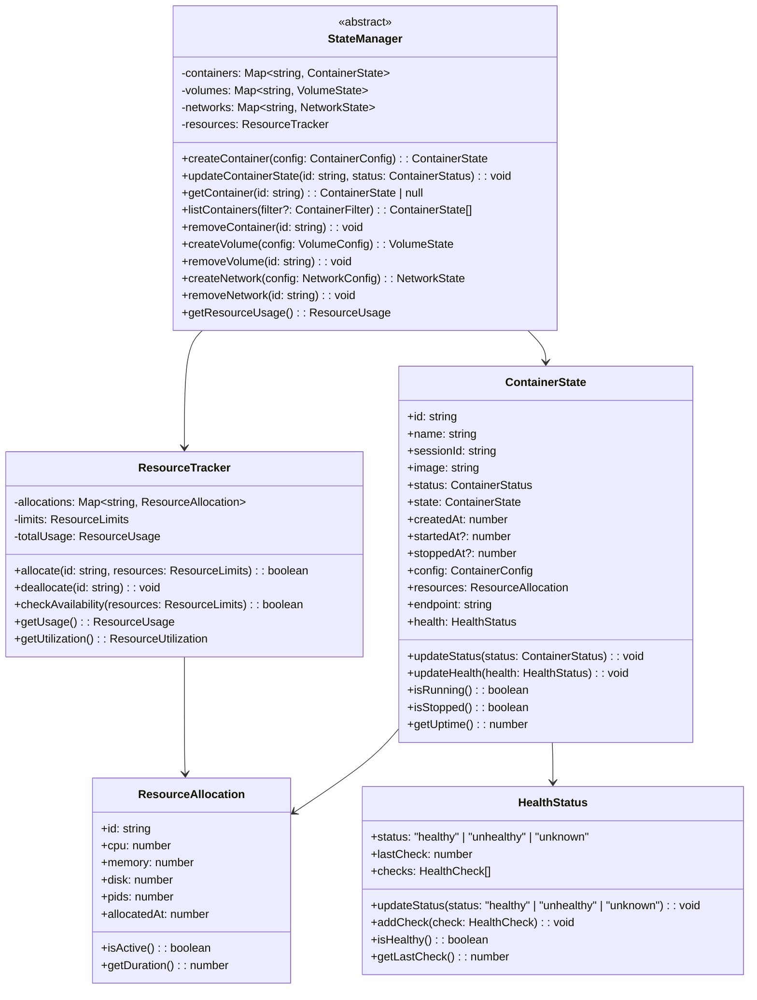

## Testing Architecture

### 9. Test Architecture Overview

```mermaid
graph TB
    subgraph "Test Categories"
        UNIT_TESTS[Unit Tests]
        INTEGRATION_TESTS[Integration Tests]
        DEMO_TESTS[Demo Tests]
        COMPARISON_TESTS[Comparison Tests]
        PERFORMANCE_TESTS[Performance Tests]
    end

    subgraph "Unit Tests"
        TYPE_TESTS[types.test.ts]
        ERROR_TESTS[errors.test.ts]
        SCHEMA_TESTS[schema validation tests]
        HELPER_TESTS[helper function tests]
    end

    subgraph "Integration Tests"
        INTERFACE_TESTS[interface-usage.test.ts]
        LIFECYCLE_TESTS[lifecycle tests]
        RESOURCE_TESTS[resource management tests]
        ERROR_INTEGRATION_TESTS[error handling integration]
    end

    subgraph "Demo Tests"
        ADVANCED_TESTS[advanced-patterns.test.ts]
        ERROR_DEMO_TESTS[error-handling.test.ts]
        WORKFLOW_TESTS[workflow tests]
        SCENARIO_TESTS[scenario tests]
    end

    subgraph "Comparison Tests"
        DRIVER_COMPARISON_TESTS[driver-comparison.test.ts]
        PERFORMANCE_COMPARISON[performance comparison]
        BEHAVIOR_COMPARISON[behavior comparison]
        FEATURE_COMPARISON[feature comparison]
    end

    subgraph "Test Infrastructure"
        MOCK_DRIVERS[Mock Drivers]
        TEST_UTILS[Test Utilities]
        TEST_DATA[Test Data]
        ASSERTIONS[Custom Assertions]
        FIXTURES[Test Fixtures]
    end

    subgraph "Test Execution"
        VITEST[Vitest Test Runner]
        COVERAGE[Coverage Reporter]
        REPORTERS[Test Reporters]
        MOCKING[Mocking Framework]
    end

    UNIT_TESTS --> TYPE_TESTS
    UNIT_TESTS --> ERROR_TESTS
    UNIT_TESTS --> SCHEMA_TESTS
    UNIT_TESTS --> HELPER_TESTS

    INTEGRATION_TESTS --> INTERFACE_TESTS
    INTEGRATION_TESTS --> LIFECYCLE_TESTS
    INTEGRATION_TESTS --> RESOURCE_TESTS
    INTEGRATION_TESTS --> ERROR_INTEGRATION_TESTS

    DEMO_TESTS --> ADVANCED_TESTS
    DEMO_TESTS --> ERROR_DEMO_TESTS
    DEMO_TESTS --> WORKFLOW_TESTS
    DEMO_TESTS --> SCENARIO_TESTS

    COMPARISON_TESTS --> DRIVER_COMPARISON_TESTS
    COMPARISON_TESTS --> PERFORMANCE_COMPARISON
    COMPARISON_TESTS --> BEHAVIOR_COMPARISON
    COMPARISON_TESTS --> FEATURE_COMPARISON

    TYPE_TESTS --> MOCK_DRIVERS
    ERROR_TESTS --> MOCK_DRIVERS
    INTERFACE_TESTS --> MOCK_DRIVERS
    ADVANCED_TESTS --> MOCK_DRIVERS
    ERROR_DEMO_TESTS --> MOCK_DRIVERS
    DRIVER_COMPARISON_TESTS --> MOCK_DRIVERS

    TYPE_TESTS --> TEST_UTILS
    ERROR_TESTS --> TEST_UTILS
    INTERFACE_TESTS --> TEST_UTILS
    ADVANCED_TESTS --> TEST_UTILS
    ERROR_DEMO_TESTS --> TEST_UTILS
    DRIVER_COMPARISON_TESTS --> TEST_UTILS

    VITEST --> UNIT_TESTS
    VITEST --> INTEGRATION_TESTS
    VITEST --> DEMO_TESTS
    VITEST --> COMPARISON_TESTS
    VITEST --> PERFORMANCE_TESTS

    VITEST --> COVERAGE
    VITEST --> REPORTERS
    VITEST --> MOCKING

    style UNIT_TESTS fill:#e8f5e8,stroke:#4caf50,stroke-width:2px
    style INTEGRATION_TESTS fill:#e3f2fd,stroke:#2196f3,stroke-width:2px
    style DEMO_TESTS fill:#fff3e0,stroke:#ff9800,stroke-width:2px
    style COMPARISON_TESTS fill:#f3e5f5,stroke:#9c27b0,stroke-width:2px
```

### 10. Mock Driver Test Architecture

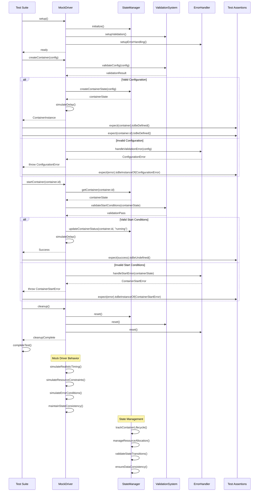

## Integration Architecture

### 11. Package Integration Architecture

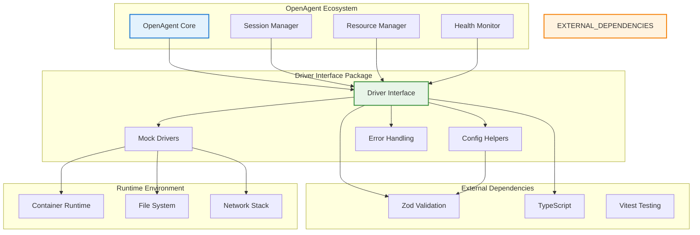

### 12. API Integration Flow

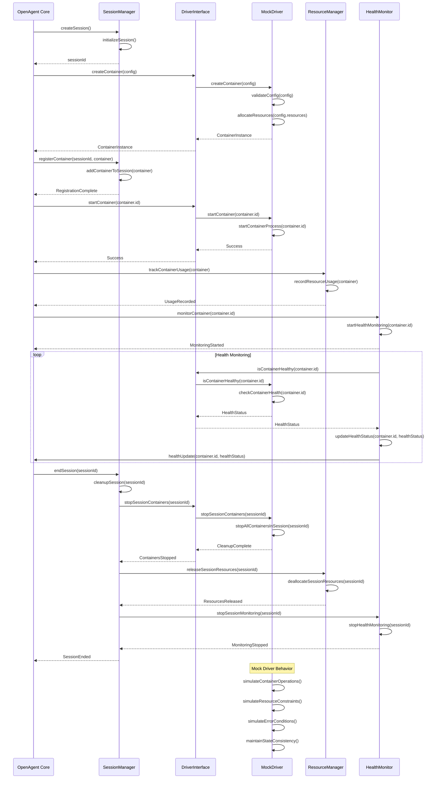

## Performance Architecture

### 13. Performance Optimization Architecture

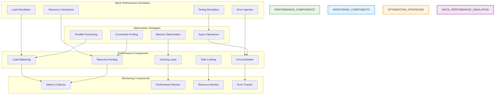

### 14. Performance Monitoring Architecture

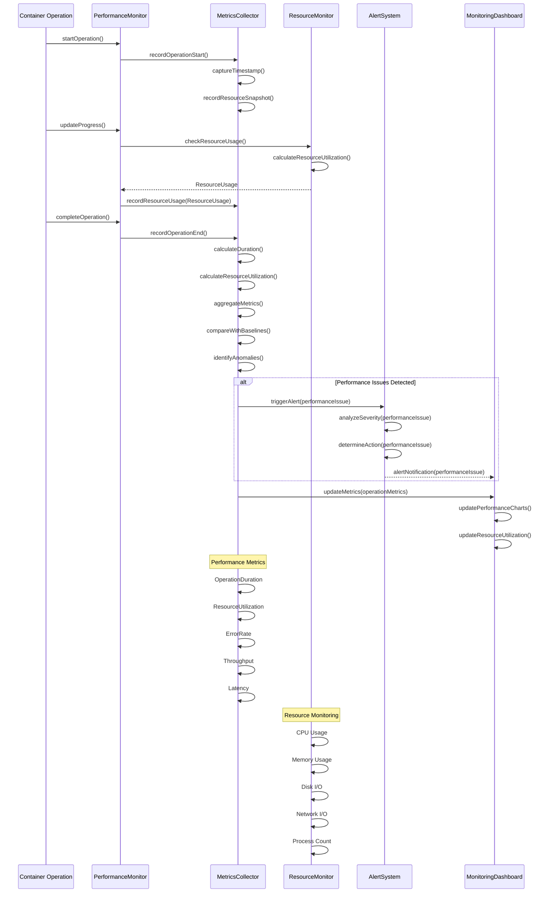

## Security Architecture

### 15. Security Implementation Architecture

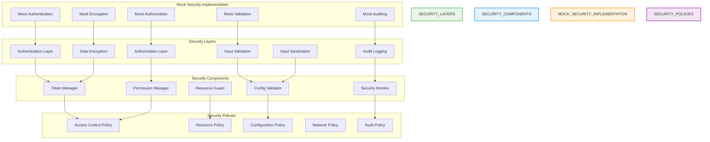

### 16. Security Monitoring Architecture

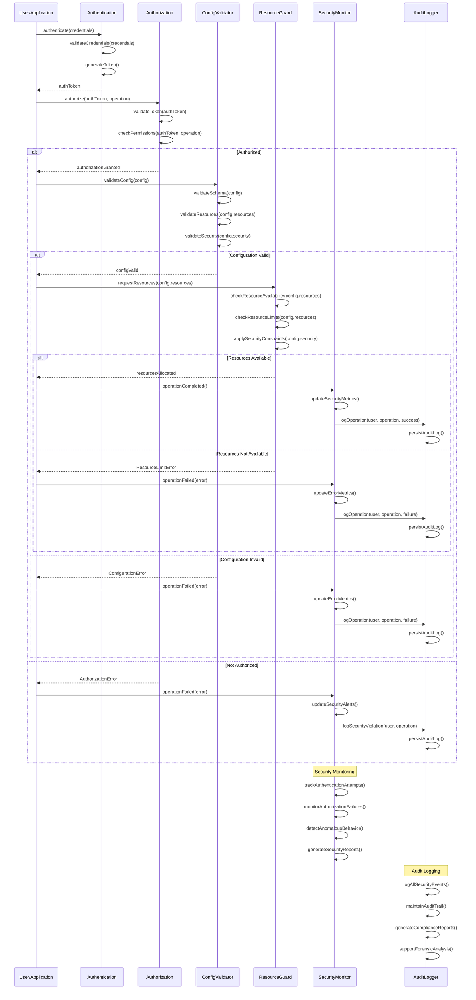

## Summary

The Driver Interface package implements a comprehensive architecture with:

1. **Layered Architecture**: Clear separation between interface, implementation, and runtime layers
2. **Type-Safe Implementation**: Strong TypeScript typing with Zod validation
3. **Mock Driver Architecture**: Realistic simulation with configurable behavior
4. **State Management**: Comprehensive state tracking and resource management
5. **Error Handling**: Hierarchical error system with retry logic and recovery
6. **Testing Infrastructure**: Comprehensive test coverage with multiple test categories
7. **Performance Optimization**: Resource pooling, caching, and performance monitoring
8. **Security Implementation**: Authentication, authorization, and security monitoring
9. **Integration Architecture**: Seamless integration with OpenAgent ecosystem
10. **Monitoring and Observability**: Comprehensive metrics collection and alerting

This architecture ensures robust operation, maintainability, and extensibility while providing realistic simulation of container management operations.