# Interface Relationships Diagram

## Overview

This document details the relationships between interfaces, types, and implementations in the Driver Interface package. It provides a comprehensive view of how components interact and depend on each other.

## Core Interface Hierarchy

### Primary Interface: ContainerDriver

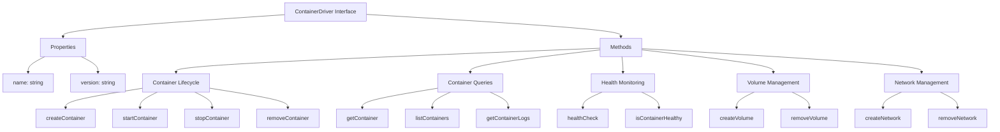

## Type Dependencies

### Configuration Types Hierarchy

```mermaid
graph TB
    CC[ContainerConfig] --> RESOURCES[ResourceLimits]
    CC --> SECURITY[SecurityOptions]
    CC --> VOLUMES[VolumeMount[]]
    CC --> NETWORK[string]
    CC --> ENV[Record<string, string>]
    CC --> LABELS[Record<string, string>]

    RESOURCES --> CPU[number]
    RESOURCES --> MEMORY[number]
    RESOURCES --> DISK[number]
    RESOURCES --> PIDS[number]

    SECURITY --> RO[readOnly: boolean]
    SECURITY --> NNP[noNewPrivileges: boolean]
    SECURITY --> USER[user: string]
    SECURITY --> CAPS[capabilities]

    CAPS --> DROP[string[]]
    CAPS --> ADD[string[]]

    VOLUMES --> SOURCE[string]
    VOLUMES --> TARGET[string]
    VOLUMES --> RO[readOnly?: boolean]
    VOLUMES --> TYPE[type?: string]
```

### Container Instance Types

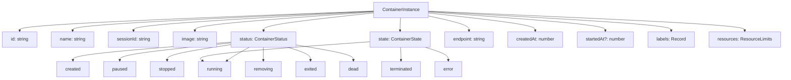

### Resource Management Types

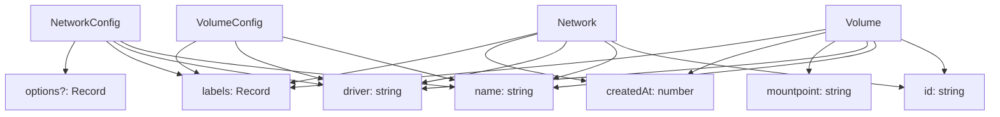

### Operation Options Types

```mermaid
graph TB
    CF[ContainerFilter] --> SESSIONID[sessionId?: string]
    CF --> STATUS[status?: ContainerStatus]
    CF --> STATE[state?: ContainerState]
    CF --> LABEL[label?: Record<string, string>]

    SO[StopOptions] --> TIMEOUT[timeout?: number]
    SO --> FORCE[force?: boolean]

    LO[LogOptions] --> FOLLOW[follow?: boolean]
    LO --> TAIL[tail?: number]
    LO --> SINCE[since?: number]
    LO --> TIMESTAMPS[timestamps?: boolean]

    DH[DriverHealth] --> STATUS[status: 'healthy' | 'unhealthy']
    DH --> VERSION[version: string]
    DH --> UPTIME[uptime: number]
    DH --> CONTAINERS[containers]
    DH --> ERROR[error?: string]

    CONTAINERS --> TOTAL[total: number]
    CONTAINERS --> RUNNING[running: number]
    CONTAINERS --> STOPPED[stopped: number]
```

## Schema Validation Relationships

### Zod Schema Dependencies

```mermaid
graph LR
    CCS[ContainerConfigSchema] --> RLS[ResourceLimitsSchema]
    CCS --> SOS[SecurityOptionsSchema]
    CCS --> VSZ[VolumeMountSchema]

    RLS --> CPUZ[z.number().min(0)]
    RLS --> MEMZ[z.number().min(1)]
    RLS --> DISKZ[z.number().min(1)]
    RLS --> PIDSZ[z.number().min(1)]

    SOS --> ROZ[z.boolean()]
    SOS --> NNPZ[z.boolean()]
    SOS --> USERZ[z.string()]
    SOS --> CAPSZ[CapabilitiesSchema]

    CAPSZ --> DROPZ[z.array(z.string())]
    CAPSZ --> ADDZ[z.array(z.string())]

    VSZ --> SOURCEZ[z.string()]
    VSZ --> TARGETZ[z.string()]
    VSZ --> ROZ[z.boolean().optional()]
    VSZ --> TYPEZ[z.enum(['bind', 'volume']).optional()]
```

## Error Hierarchy Relationships

### Error Type Inheritance

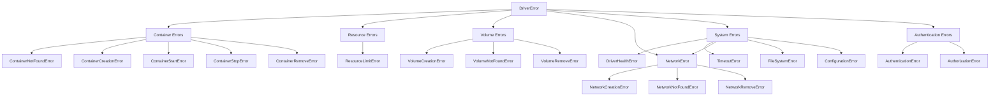

### Error Properties and Relationships

```mermaid
graph TB
    DE[DriverError] --> extends[extends Error]
    DE --> CODE[code: string]
    DE --> RETRYABLE[retryable: boolean]
    DE --> CONTEXT[context?: any]

    CNFE --> CONTAINERID[containerId: string]
    CCrE --> DETAILS[details?: any]
    CSE --> CONTAINERID[containerId: string]
    CSE --> REASON[reason: string]
    CStE --> CONTAINERID[containerId: string]
    CStE --> REASON[reason: string]
    CReE --> CONTAINERID[containerId: string]
    CReE --> REASON[reason: string]

    VCrE --> VOLUMENAME[volumeName: string]
    VCrE --> REASON[reason: string]
    VNFE --> VOLUMEID[volumeId: string]
    VReE --> VOLUMEID[volumeId: string]
    VReE --> REASON[reason: string]

    NCrE --> NETWORKNAME[networkName: string]
    NCrE --> REASON[reason: string]
    NNFE --> NETWORKID[networkId: string]
    NReE --> NETWORKID[networkId: string]
    NReE --> REASON[reason: string]

    RLE --> RESOURCE[resource: string]
    RLE --> LIMIT[limit: number]
    RLE --> REQUESTED[requested: number]

    TE --> OPERATION[operation: string]
    TE --> TIMEOUT[timeout: number]
```

## Configuration Helper Relationships

### Helper Function Dependencies

```mermaid
graph TB
    CDC[createDriverConfig] --> CONFIG[Partial<ContainerConfig>]
    CDC --> DEFAULTS[Default Values]

    DEFAULTS --> DEF_SESSIONID[sessionId: ""]
    DEFAULTS --> DEF_IMAGE[image: ""]
    DEFAULTS --> DEF_COMMAND[command: []]
    DEFAULTS --> DEF_ENV[env: {}]
    DEFAULTS --> DEF_LABELS[labels: {}]
    DEFAULTS --> DEF_RESOURCES[resources: ResourceLimits]
    DEFAULTS --> DEF_VOLUMES[volumes: []]
    DEFAULTS --> DEF_NETWORK[network: string]
    DEFAULTS --> DEF_SECURITY[security: SecurityOptions]

    CRL[createResourceLimits] --> LIMITS[Partial<ResourceLimits>]
    CRL --> RL_DEFAULTS[Resource Defaults]

    RL_DEFAULTS --> DEF_CPU[cpu: 0.5]
    RL_DEFAULTS --> DEF_MEMORY[memory: 512]
    RL_DEFAULTS --> DEF_DISK[disk: 1024]
    RL_DEFAULTS --> DEF_PIDS[pids: 100]

    CSO[createSecurityOptions] --> OPTS[Partial<SecurityOptions>]
    CSO --> SO_DEFAULTS[Security Defaults]

    SO_DEFAULTS --> DEF_READONLY[readOnly: true]
    SO_DEFAULTS --> DEF_NNP[noNewPrivileges: true]
    SO_DEFAULTS --> DEF_USER[user: "openagent"]
    SO_DEFAULTS --> DEF_CAPS[capabilities]

    DEF_CAPS --> DEF_DROP[drop: ["ALL"]]
    DEF_CAPS --> DEF_ADD[add: []]
```

### Validation Function Relationships

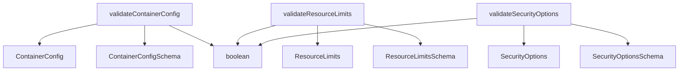

## Mock Implementation Relationships

### Driver Implementation Hierarchy

```mermaid
graph TB
    CD[ContainerDriver Interface] --> MD[MockDockerDriver]
    CD --> ML[MockLocalDriver]

    MD --> extends[implements ContainerDriver]
    MD --> NAME[name: "mock-docker"]
    MD --> VERSION[version: "1.0.0"]
    MD --> DOCKER_SPECIFIC[Docker-specific behavior]

    ML --> extends[implements ContainerDriver]
    ML --> NAME[name: "mock-local"]
    ML --> VERSION[version: "1.0.0"]
    ML --> LOCAL_SPECIFIC[Local-specific behavior]

    DOCKER_SPECIFIC --> LIMITS[CPU: 4.0 max]
    DOCKER_SPECIFIC --> TIMING[100-200ms operations]
    DOCKER_SPECIFIC --> ENDPOINTS[Docker-like endpoints]

    LOCAL_SPECIFIC --> LIMITS[CPU: 2.0 max]
    LOCAL_SPECIFIC --> TIMING[200-300ms operations]
    LOCAL_SPECIFIC --> ENDPOINTS[Local-like endpoints]
```

### Mock Driver Internal Relationships

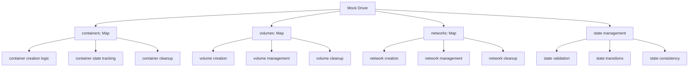

## Interface Usage Flow

### Typical Usage Pattern

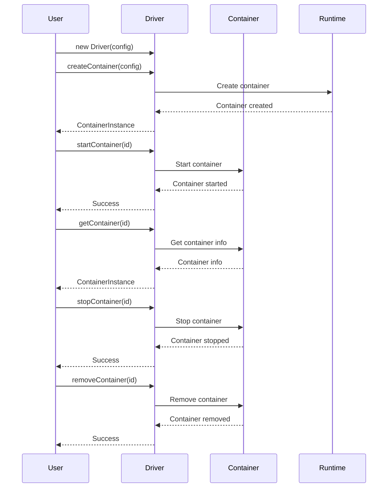

### Error Handling Flow

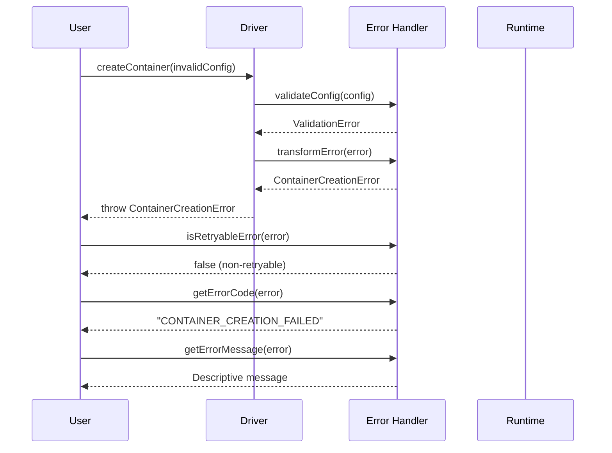

### Resource Management Flow

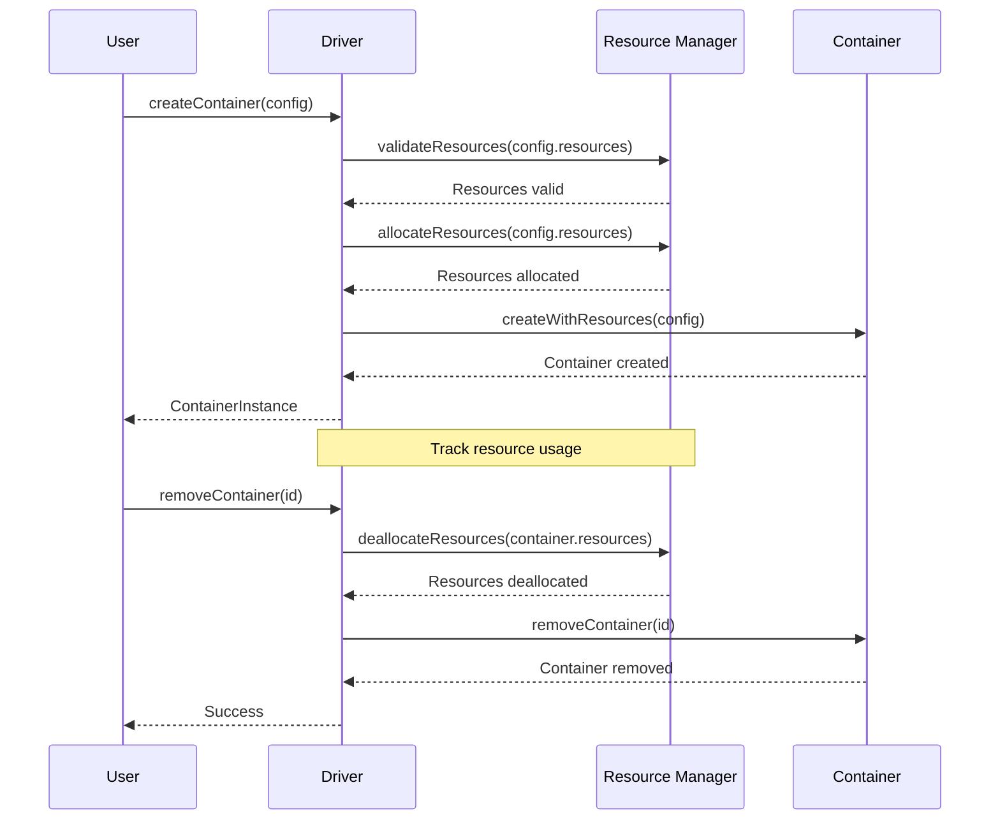

## Cross-Driver Relationships

### Driver Comparison Patterns

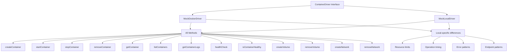

### Interface Compliance Verification

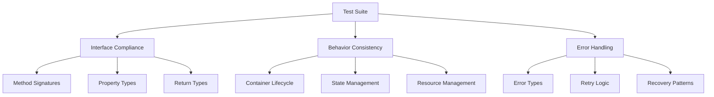

## Integration Relationships

### Package Dependencies

```mermaid
graph TB
    DRIVER_INTERFACE[Driver Interface Package] --> EXTERNAL_DEPS[External Dependencies]
    DRIVER_INTERFACE --> INTERNAL_DEPS[Internal Dependencies]

    EXTERNAL_DEPS --> ZOD[zod]
    EXTERNAL_DEPS --> TYPESCRIPT[TypeScript]
    EXTERNAL_DEPS --> NODE_TYPES[@types/node]

    INTERNAL_DEPS --> SOURCE[source/]
    INTERNAL_DEPS --> TESTS[tests/]

    SOURCE --> INDEX[index.ts]
    SOURCE --> TYPES[types.ts]
    SOURCE --> ERRORS[errors.ts]

    TESTS --> MOCKS[mocks/]
    TESTS --> DEMO[demo/]

    MOCKS --> SOURCE
    DEMO --> SOURCE
    DEMO --> MOCKS
```

### Runtime Dependencies

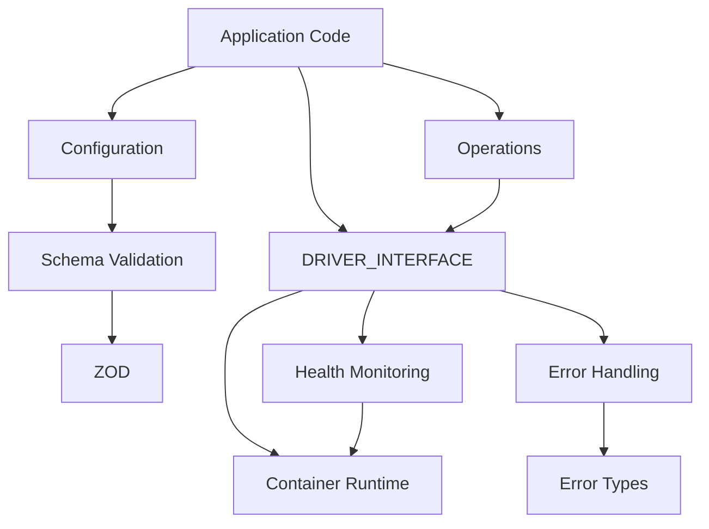

## Summary

The Driver Interface package demonstrates a well-structured type system with:

1. **Hierarchical Interface Design**: Clear separation between core interface, types, and implementations
2. **Comprehensive Type Safety**: Strong typing with runtime validation through Zod schemas
3. **Extensible Error Handling**: Hierarchical error system with retry logic
4. **Configuration Management**: Fluent configuration builders with validation
5. **Mock Implementations**: Realistic mock drivers for testing and demonstration
6. **Clear Separation of Concerns**: Types, errors, and implementations properly separated
7. **Testing Infrastructure**: Comprehensive test coverage with cross-driver comparison

This relationship structure ensures maintainability, type safety, and extensibility while providing a solid foundation for container management operations.