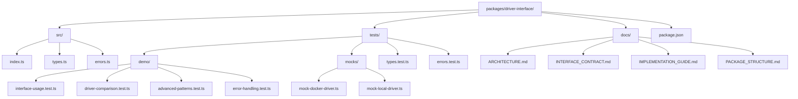
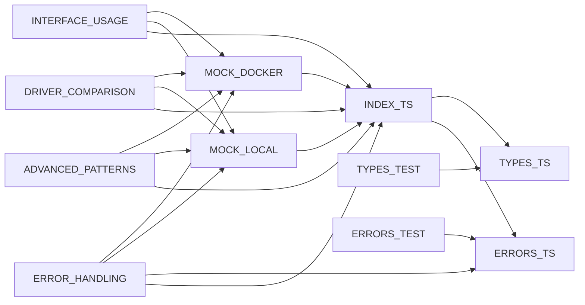

# Package Structure Diagram

## Overview

This document provides a comprehensive view of the Driver Interface package structure, including file organization, module relationships, and architectural patterns.

## Package Structure



## Source Code Organization

### Core Source Files

```
src/
├── index.ts              # Main exports and configuration helpers
├── types.ts              # Type definitions and Zod schemas
└── errors.ts             # Error class hierarchy and utilities
```

#### `src/index.ts` - Main Entry Point
- **Purpose**: Central export hub for all public APIs
- **Exports**:
  - All error classes from `errors.ts`
  - All types and schemas from `types.ts`
  - Configuration helper functions
  - Package version constant
- **Key Functions**:
  - `createDriverConfig()` - Container configuration builder
  - `createResourceLimits()` - Resource limits builder
  - `createSecurityOptions()` - Security options builder
  - `validateContainerConfig()` - Configuration validation
  - `validateResourceLimits()` - Resource validation
  - `validateSecurityOptions()` - Security validation

#### `src/types.ts` - Type Definitions
- **Purpose**: Complete type system for container operations
- **Key Types**:
  - `ContainerDriver` - Main interface contract
  - `ContainerConfig` - Container configuration
  - `ContainerInstance` - Container runtime instance
  - `ResourceLimits` - Resource constraints
  - `SecurityOptions` - Security settings
  - Volume and Network types
- **Schemas**:
  - `ContainerConfigSchema` - Zod validation schema
  - `ResourceLimitsSchema` - Resource validation
  - `SecurityOptionsSchema` - Security validation

#### `src/errors.ts` - Error Hierarchy
- **Purpose**: Comprehensive error handling system
- **Base Classes**:
  - `DriverError` - Base error class
- **Container Errors**:
  - `ContainerNotFoundError`
  - `ContainerCreationError`
  - `ContainerStartError`
  - `ContainerStopError`
  - `ContainerRemoveError`
- **Resource Errors**:
  - `ResourceLimitError`
- **Volume Errors**:
  - `VolumeCreationError`
  - `VolumeNotFoundError`
  - `VolumeRemoveError`
- **Network Errors**:
  - `NetworkCreationError`
  - `NetworkNotFoundError`
  - `NetworkRemoveError`
- **System Errors**:
  - `DriverHealthError`
  - `TimeoutError`
  - `NetworkError`
  - `FileSystemError`
- **Security Errors**:
  - `AuthenticationError`
  - `AuthorizationError`
- **Utilities**:
  - `isDriverError()` - Type guard
  - `isRetryableError()` - Retry check
  - `getErrorCode()` - Code extraction
  - `getErrorMessage()` - Message extraction

## Test Organization

### Test Structure

```
tests/
├── demo/                  # Demonstration and example tests
│   ├── interface-usage.test.ts      # Basic interface usage
│   ├── driver-comparison.test.ts     # Cross-driver comparison
│   ├── advanced-patterns.test.ts     # Advanced usage patterns
│   └── error-handling.test.ts        # Error handling examples
├── mocks/                # Mock driver implementations
│   ├── mock-docker-driver.ts        # Docker-like mock
│   └── mock-local-driver.ts         # Local runtime mock
├── types.test.ts         # Type validation tests
└── errors.test.ts        # Error class tests
```

### Test Categories

#### Demonstration Tests (`tests/demo/`)

##### `interface-usage.test.ts`
- **Purpose**: Basic interface usage patterns
- **Coverage**:
  - Driver initialization
  - Container lifecycle management
  - Configuration validation
  - Resource management
  - Cross-driver consistency
- **Test Count**: 14 tests

##### `driver-comparison.test.ts`
- **Purpose**: Cross-driver behavior comparison
- **Coverage**:
  - Driver capabilities comparison
  - Performance characteristics
  - Error handling differences
  - State management consistency
  - Resource management comparison
  - Interface compliance verification
- **Test Count**: 14 tests

##### `advanced-patterns.test.ts`
- **Purpose**: Advanced usage scenarios
- **Coverage**:
  - Multi-container orchestration
  - Session-based management
  - Resource pooling
  - Error recovery patterns
  - Event-driven architecture
  - Monitoring and metrics
  - Cross-driver patterns
- **Test Count**: 13 tests

##### `error-handling.test.ts`
- **Purpose**: Comprehensive error handling
- **Coverage**:
  - Driver error type usage
  - Retry logic implementation
  - Error recovery strategies
  - Error logging and reporting
  - User-friendly error messages
  - Cross-driver error consistency
  - Error prevention and validation
  - Circuit breaker patterns
- **Test Count**: 16 tests

#### Mock Implementations (`tests/mocks/`)

##### `mock-docker-driver.ts`
- **Purpose**: Docker-like driver implementation
- **Characteristics**:
  - Simulates Docker behavior patterns
  - Resource limits: CPU 4.0 cores max
  - Operation timing: 100-200ms
  - Realistic error scenarios
  - Full interface compliance

##### `mock-local-driver.ts`
- **Purpose**: Local runtime driver implementation
- **Characteristics**:
  - Simulates local container runtime
  - Resource limits: CPU 2.0 cores max
  - Operation timing: 200-300ms
  - Different error handling patterns
  - Alternative implementation approach

#### Unit Tests

##### `types.test.ts`
- **Purpose**: Type system validation
- **Coverage**:
  - Schema validation
  - Type inference
  - Configuration helpers
- **Test Count**: 10 tests

##### `errors.test.ts`
- **Purpose**: Error class validation
- **Coverage**:
  - Error instantiation
  - Error properties
  - Type guard functions
  - Utility functions
- **Test Count**: 24 tests

## Documentation Organization

### Documentation Structure

```
docs/
├── ARCHITECTURE.md              # Overall architecture overview
├── INTERFACE_CONTRACT.md        # Interface contract specification
├── IMPLEMENTATION_GUIDE.md      # Driver implementation guide
└── PACKAGE_STRUCTURE.md         # This document
```

#### `ARCHITECTURE.md`
- **Purpose**: High-level architectural overview
- **Content**:
  - Design principles
  - Package structure
  - Core components
  - Mock implementations
  - Testing strategy
  - Integration points
  - Extensibility patterns
  - Security model

#### `INTERFACE_CONTRACT.md`
- **Purpose**: Detailed interface specification
- **Content**:
  - ContainerDriver interface contract
  - Type definitions
  - Method specifications
  - Error handling contracts
  - Validation schemas
  - Implementation requirements

#### `IMPLEMENTATION_GUIDE.md`
- **Purpose**: Step-by-step implementation guide
- **Content**:
  - Prerequisites
  - Driver architecture
  - Implementation steps
  - Testing strategies
  - Performance considerations
  - Security best practices
  - Common pitfalls and solutions

## Module Dependencies

### Internal Dependencies



### External Dependencies

```mermaid
graph TB
    DRIVER_INTERFACE --> ZOD[zod]
    DRIVER_INTERFACE --> VITEST[vitest]
    DRIVER_INTERFACE --> TYPESCRIPT[typescript]
    DRIVER_INTERFACE --> TYPES_NODE[@types/node]
```

## Configuration Files

### Package Configuration

```json
{
  "name": "@openagent/driver-interface",
  "version": "1.0.0",
  "main": "dist/index.js",
  "module": "dist/index.esm.js",
  "types": "dist/index.d.ts",
  "scripts": {
    "build": "rollup -c",
    "test": "vitest run",
    "test:watch": "vitest",
    "test:coverage": "vitest run --coverage",
    "lint": "biome lint",
    "format": "biome format --write",
    "typecheck": "tsc --noEmit"
  },
  "dependencies": {
    "zod": "^3.22.0"
  },
  "devDependencies": {
    "vitest": "^1.0.0",
    "typescript": "^5.0.0",
    "@types/node": "^20.0.0"
  }
}
```

## Build Outputs

### Distribution Structure

```
dist/
├── index.js              # CommonJS build
├── index.esm.js          # ESM build
├── index.d.ts            # TypeScript declarations
└── types/                # Type definitions
    ├── interfaces.d.ts
    ├── containers.d.ts
    ├── volumes.d.ts
    ├── networks.d.ts
    ├── errors.d.ts
    ├── validation.d.ts
    └── index.d.ts
```

## Key Architectural Patterns

### 1. Interface-First Design
- All functionality defined through TypeScript interfaces
- Mock implementations demonstrate interface compliance
- Type safety enforced throughout the codebase

### 2. Comprehensive Error Handling
- Hierarchical error system with specific error types
- Retry logic built into error classification
- Consistent error patterns across all operations

### 3. Configuration Builder Pattern
- Fluent configuration helpers with sensible defaults
- Schema validation for all configuration objects
- Type-safe configuration construction

### 4. Mock-Based Testing
- Realistic mock implementations for testing
- Cross-driver comparison capabilities
- Performance characteristics simulation

### 5. Extensible Architecture
- Plugin-based driver implementation
- Configuration-driven behavior
- Event-driven patterns for advanced scenarios

## Usage Patterns

### Basic Usage
```typescript
import { createDriverConfig } from '@openagent/driver-interface';

// const driver = new DockerDriver(); // Production driver
const config = createDriverConfig({
  sessionId: 'test-session',
  image: 'nginx:alpine'
});

const container = await driver.createContainer(config);
await driver.startContainer(container.id);
```

### Advanced Usage
```typescript
import {
  createDriverConfig,
  createResourceLimits,
  createSecurityOptions,
  validateContainerConfig
} from '@openagent/driver-interface';

const config = createDriverConfig({
  sessionId: 'advanced-session',
  image: 'postgres:15',
  resources: createResourceLimits({
    cpu: 2.0,
    memory: 2048,
    disk: 4096,
    pids: 200
  }),
  security: createSecurityOptions({
    readOnly: true,
    noNewPrivileges: true,
    user: 'postgres',
    capabilities: {
      drop: ['ALL'],
      add: ['NET_BIND_SERVICE']
    }
  })
});

if (validateContainerConfig(config)) {
  const container = await driver.createContainer(config);
}
```

## Testing Patterns

### Unit Testing
```typescript
import { MockDockerDriver } from '@openagent/driver-interface/tests/mocks/mock-docker-driver';

const driver = new MockDockerDriver();
// Test individual methods
```

### Integration Testing
```typescript
import { MockDockerDriver, MockLocalDriver } from '@openagent/driver-interface/tests/mocks';

const dockerDriver = new MockDockerDriver();
const localDriver = new MockLocalDriver();
// Test cross-driver compatibility
```

### Performance Testing
```typescript
const startTime = Date.now();
await driver.createContainer(config);
const duration = Date.now() - startTime;
// Validate performance characteristics
```

## Summary

The Driver Interface package is structured to provide:

1. **Clear Separation of Concerns**: Types, errors, and implementations are properly separated
2. **Comprehensive Testing**: Full coverage with mock implementations for realistic testing
3. **Type Safety**: Strong TypeScript typing with runtime validation
4. **Extensibility**: Plugin architecture for adding new drivers
5. **Documentation**: Complete documentation with examples and guides
6. **Developer Experience**: Helper functions and utilities for common use cases

This structure ensures that the package is maintainable, testable, and extensible while providing a solid foundation for container management operations.