# Usage Patterns Diagram

## Overview

This document illustrates common usage patterns for the Driver Interface package, demonstrating how to effectively use the container management interface in various scenarios.

## Basic Usage Patterns

### 1. Simple Container Lifecycle

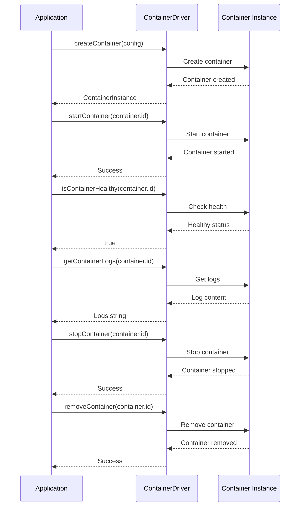
```mermaid
sequenceDiagram
    participant App as Application
    participant Driver as ContainerDriver
    participant Container as Container Instance

    App->>Driver: createContainer(config)
    Driver->>Container: Create container
    Container-->>Driver: Container created
    Driver-->>App: ContainerInstance

    App->>Driver: startContainer(container.id)
    Driver->>Container: Start container
    Container-->>Driver: Container started
    Driver-->>App: Success

    App->>Driver: isContainerHealthy(container.id)
    Driver->>Container: Check health
    Container-->>Driver: Healthy status
    Driver-->>App: true

    App->>Driver: getContainerLogs(container.id)
    Driver->>Container: Get logs
    Container-->>Driver: Log content
    Driver-->>App: Logs string

    App->>Driver: stopContainer(container.id)
    Driver->>Container: Stop container
    Container-->>Driver: Container stopped
    Driver-->>App: Success

    App->>Driver: removeContainer(container.id)
    Driver->>Container: Remove container
    Container-->>Driver: Container removed
    Driver-->>App: Success
```

### 2. Configuration Builder Pattern

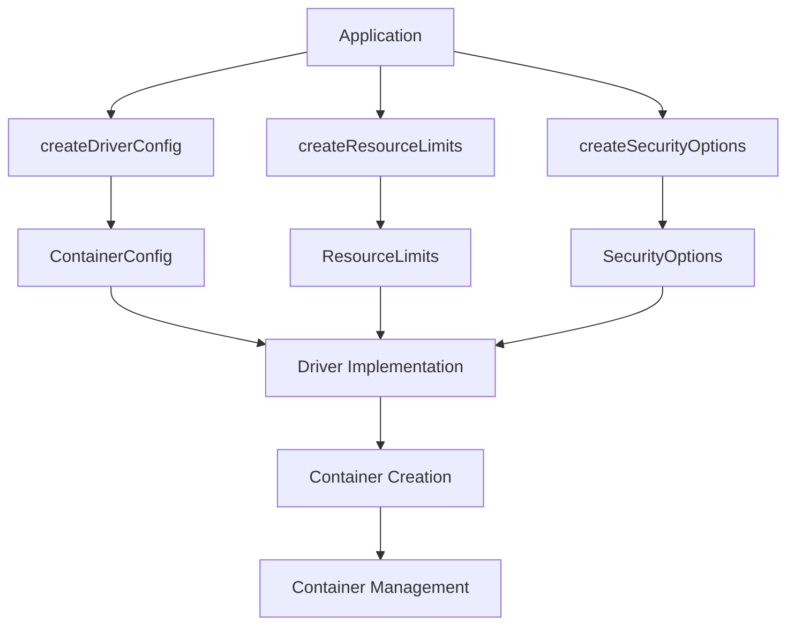
```mermaid
graph TB
    A[Application] --> B[createDriverConfig]
    A --> C[createResourceLimits]
    A --> D[createSecurityOptions]

    B --> E[ContainerConfig]
    C --> F[ResourceLimits]
    D --> G[SecurityOptions]

    E --> H[Driver Implementation]
    F --> H
    G --> H

    H --> I[Container Creation]
    I --> J[Container Management]
```

### 3. Error Handling Pattern

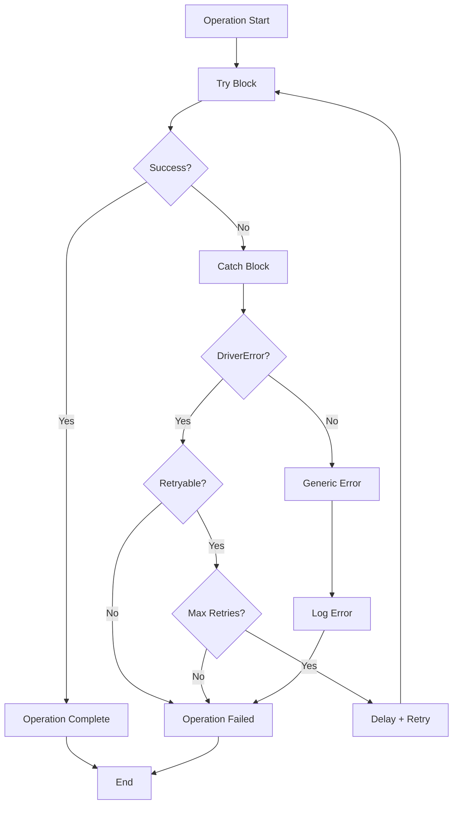
```mermaid
flowchart TD
    Start[Operation Start] --> Try[Try Block]
    Try --> Success{Success?}
    Success -->|Yes| Complete[Operation Complete]
    Success -->|No| Catch[Catch Block]

    Catch --> ErrorType{DriverError?}
    ErrorType -->|Yes| Retryable{Retryable?}
    ErrorType -->|No| Generic[Generic Error]

    Retryable -->|Yes| RetryCount{Max Retries?}
    Retryable -->|No| Fail[Operation Failed]

    RetryCount -->|No| Fail
    RetryCount -->|Yes| Delay[Delay + Retry]
    Delay --> Try

    Generic --> Log[Log Error]
    Log --> Fail

    Complete --> End[End]
    Fail --> End
```

## Advanced Usage Patterns

### 4. Multi-Container Orchestration

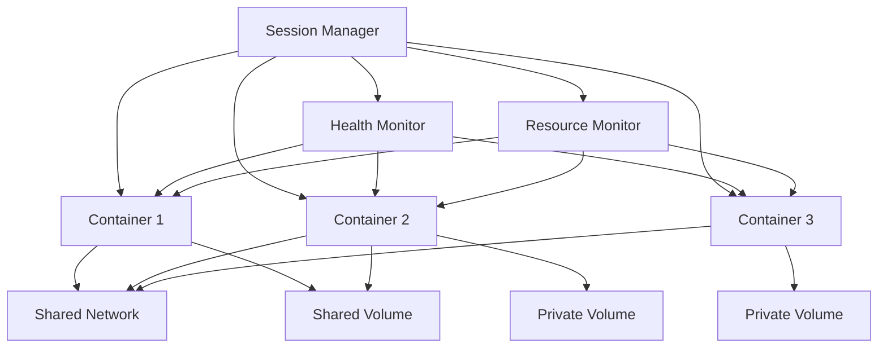
```mermaid
graph TB
    Session[Session Manager] --> Container1[Container 1]
    Session --> Container2[Container 2]
    Session --> Container3[Container 3]

    Container1 --> Network[Shared Network]
    Container2 --> Network
    Container3 --> Network

    Container1 --> Volume1[Shared Volume]
    Container2 --> Volume1

    Container2 --> Volume2[Private Volume]
    Container3 --> Volume3[Private Volume]

    Session --> HealthMonitor[Health Monitor]
    HealthMonitor --> Container1
    HealthMonitor --> Container2
    HealthMonitor --> Container3

    Session --> ResourceMonitor[Resource Monitor]
    ResourceMonitor --> Container1
    ResourceMonitor --> Container2
    ResourceMonitor --> Container3
```

### 5. Session-Based Management

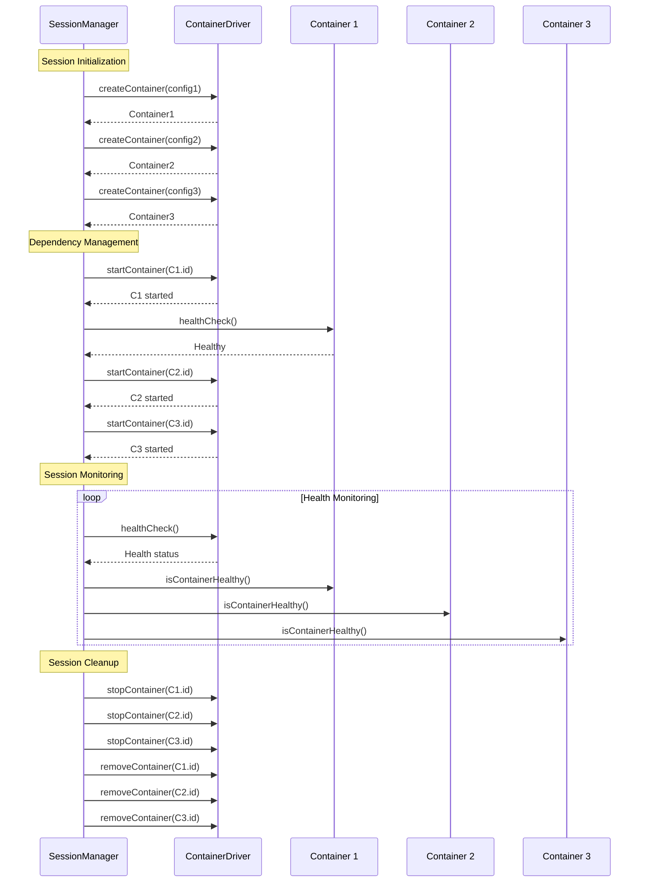
```mermaid
sequenceDiagram
    participant SM as SessionManager
    participant Driver as ContainerDriver
    participant C1 as Container 1
    participant C2 as Container 2
    participant C3 as Container 3

    Note over SM: Session Initialization
    SM->>Driver: createContainer(config1)
    Driver-->>SM: Container1
    SM->>Driver: createContainer(config2)
    Driver-->>SM: Container2
    SM->>Driver: createContainer(config3)
    Driver-->>SM: Container3

    Note over SM: Dependency Management
    SM->>Driver: startContainer(C1.id)
    Driver-->>SM: C1 started
    SM->>C1: healthCheck()
    C1-->>SM: Healthy
    SM->>Driver: startContainer(C2.id)
    Driver-->>SM: C2 started
    SM->>Driver: startContainer(C3.id)
    Driver-->>SM: C3 started

    Note over SM: Session Monitoring
    loop Health Monitoring
        SM->>Driver: healthCheck()
        Driver-->>SM: Health status
        SM->>C1: isContainerHealthy()
        SM->>C2: isContainerHealthy()
        SM->>C3: isContainerHealthy()
    end

    Note over SM: Session Cleanup
    SM->>Driver: stopContainer(C1.id)
    SM->>Driver: stopContainer(C2.id)
    SM->>Driver: stopContainer(C3.id)
    SM->>Driver: removeContainer(C1.id)
    SM->>Driver: removeContainer(C2.id)
    SM->>Driver: removeContainer(C3.id)
```

### 6. Resource Pooling Pattern

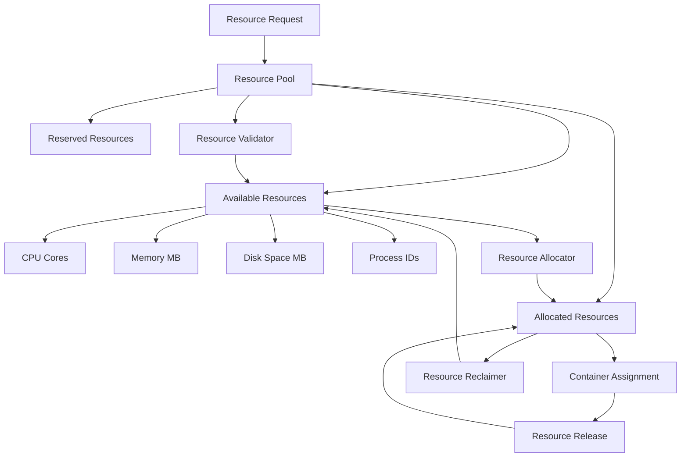
```mermaid
graph TB
    ResourcePool[Resource Pool] --> Available[Available Resources]
    ResourcePool --> Allocated[Allocated Resources]
    ResourcePool --> Reserved[Reserved Resources]

    Available --> CPU[CPU Cores]
    Available --> Memory[Memory MB]
    Available --> Disk[Disk Space MB]
    Available --> PIDs[Process IDs]

    Request[Resource Request] --> ResourcePool
    ResourcePool --> Validator[Resource Validator]
    Validator --> Available
    Available --> Allocator[Resource Allocator]

    Allocator --> Allocated
    Allocated --> Container[Container Assignment]

    Container --> Release[Resource Release]
    Release --> Allocated
    Allocated --> Reclaimer[Resource Reclaimer]
    Reclaimer --> Available
```

### 7. Event-Driven Architecture

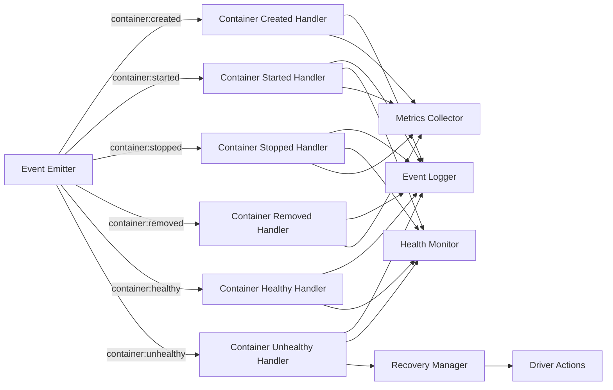
```mermaid
flowchart LR
    Events[Event Emitter] -->|container:created| Created[Container Created Handler]
    Events -->|container:started| Started[Container Started Handler]
    Events -->|container:stopped| Stopped[Container Stopped Handler]
    Events -->|container:removed| Removed[Container Removed Handler]
    Events -->|container:healthy| Healthy[Container Healthy Handler]
    Events -->|container:unhealthy| Unhealthy[Container Unhealthy Handler]

    Created --> Logger[Event Logger]
    Started --> Logger
    Stopped --> Logger
    Removed --> Logger
    Healthy --> Logger
    Unhealthy --> Logger

    Started --> HealthMonitor[Health Monitor]
    Stopped --> HealthMonitor
    Healthy --> HealthMonitor
    Unhealthy --> HealthMonitor

    Created --> Metrics[Metrics Collector]
    Removed --> Metrics
    Started --> Metrics
    Stopped --> Metrics

    Unhealthy --> Recovery[Recovery Manager]
    Recovery --> Driver[Driver Actions]
```

### 8. Cross-Driver Comparison

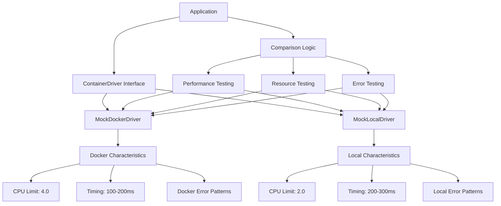
```mermaid
graph TB
    Application[Application] --> DriverInterface[ContainerDriver Interface]

    DriverInterface --> Docker[MockDockerDriver]
    DriverInterface --> Local[MockLocalDriver]

    Docker --> DockerCharacteristics[Docker Characteristics]
    Local --> LocalCharacteristics[Local Characteristics]

    DockerCharacteristics --> CPULimit4[CPU Limit: 4.0]
    DockerCharacteristics --> Timing100[Timing: 100-200ms]
    DockerCharacteristics --> ErrorDocker[Docker Error Patterns]

    LocalCharacteristics --> CPULimit2[CPU Limit: 2.0]
    LocalCharacteristics --> Timing200[Timing: 200-300ms]
    LocalCharacteristics --> ErrorLocal[Local Error Patterns]

    Application --> Comparison[Comparison Logic]
    Comparison --> Performance[Performance Testing]
    Comparison --> Resource[Resource Testing]
    Comparison --> Error[Error Testing]

    Performance --> Docker
    Performance --> Local
    Resource --> Docker
    Resource --> Local
    Error --> Docker
    Error --> Local
```

## Monitoring and Metrics Patterns

### 9. Health Monitoring Flow

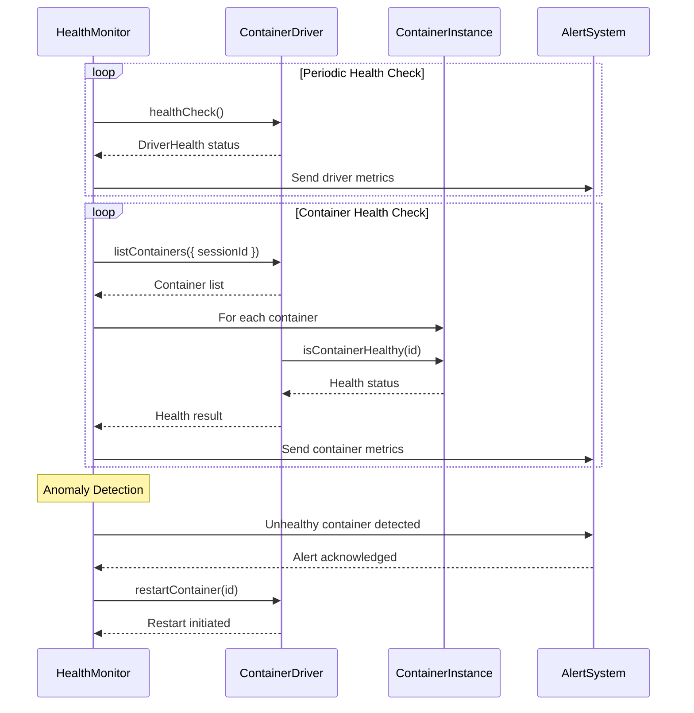
```mermaid
sequenceDiagram
    participant Monitor as HealthMonitor
    participant Driver as ContainerDriver
    participant Container as ContainerInstance
    participant Alert as AlertSystem

    loop Periodic Health Check
        Monitor->>Driver: healthCheck()
        Driver-->>Monitor: DriverHealth status
        Monitor->>Alert: Send driver metrics
    end

    loop Container Health Check
        Monitor->>Driver: listContainers({ sessionId })
        Driver-->>Monitor: Container list
        Monitor->>Container: For each container
        Driver->>Container: isContainerHealthy(id)
        Container-->>Driver: Health status
        Driver-->>Monitor: Health result
        Monitor->>Alert: Send container metrics
    end

    Note over Monitor: Anomaly Detection
    Monitor->>Alert: Unhealthy container detected
    Alert-->>Monitor: Alert acknowledged
    Monitor->>Driver: restartContainer(id)
    Driver-->>Monitor: Restart initiated
```

### 10. Metrics Collection Pattern

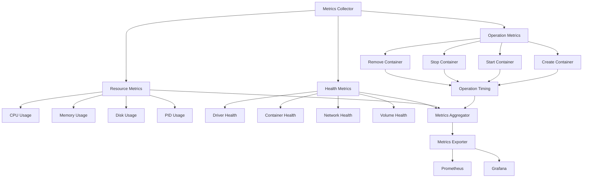
```mermaid
graph TB
    MetricsCollector[Metrics Collector] --> OperationMetrics[Operation Metrics]
    MetricsCollector --> ResourceMetrics[Resource Metrics]
    MetricsCollector --> HealthMetrics[Health Metrics]

    OperationMetrics --> CreateMetrics[Create Container]
    OperationMetrics --> StartMetrics[Start Container]
    OperationMetrics --> StopMetrics[Stop Container]
    OperationMetrics --> RemoveMetrics[Remove Container]

    ResourceMetrics --> CPUUsage[CPU Usage]
    ResourceMetrics --> MemoryUsage[Memory Usage]
    ResourceMetrics --> DiskUsage[Disk Usage]
    ResourceMetrics --> PIDUsage[PID Usage]

    HealthMetrics --> DriverHealth[Driver Health]
    HealthMetrics --> ContainerHealth[Container Health]
    HealthMetrics --> NetworkHealth[Network Health]
    HealthMetrics --> VolumeHealth[Volume Health]

    CreateMetrics --> Timing[Operation Timing]
    StartMetrics --> Timing
    StopMetrics --> Timing
    RemoveMetrics --> Timing

    Timing --> Aggregator[Metrics Aggregator]
    ResourceMetrics --> Aggregator
    HealthMetrics --> Aggregator

    Aggregator --> Exporter[Metrics Exporter]
    Exporter --> Prometheus[Prometheus]
    Exporter --> Grafana[Grafana]
```

## Error Recovery Patterns

### 11. Retry Logic Pattern

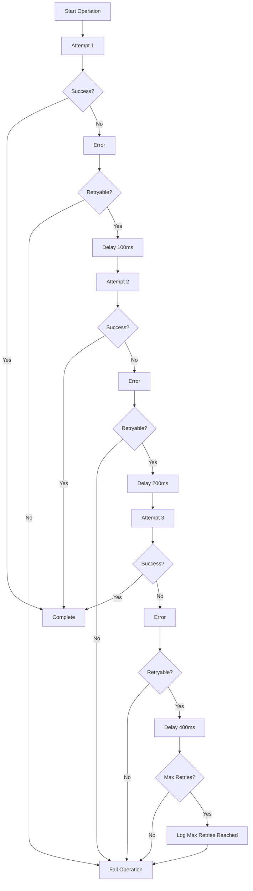
```mermaid
flowchart TD
    Start[Start Operation] --> Attempt1[Attempt 1]
    Attempt1 --> Success1{Success?}
    Success1 -->|Yes| Complete[Complete]
    Success1 -->|No| Error1[Error]

    Error1 --> Retryable1{Retryable?}
    Retryable1 -->|No| Fail[Fail Operation]
    Retryable1 -->|Yes| Delay1[Delay 100ms]

    Delay1 --> Attempt2[Attempt 2]
    Attempt2 --> Success2{Success?}
    Success2 -->|Yes| Complete
    Success2 -->|No| Error2[Error]

    Error2 --> Retryable2{Retryable?}
    Retryable2 -->|No| Fail
    Retryable2 -->|Yes| Delay2[Delay 200ms]

    Delay2 --> Attempt3[Attempt 3]
    Attempt3 --> Success3{Success?}
    Success3 -->|Yes| Complete
    Success3 -->|No| Error3[Error]

    Error3 --> Retryable3{Retryable?}
    Retryable3 -->|No| Fail
    Retryable3 -->|Yes| Delay3[Delay 400ms]

    Delay3 --> MaxRetries{Max Retries?}
    MaxRetries -->|No| Fail
    MaxRetries -->|Yes| LogRetry[Log Max Retries Reached]
    LogRetry --> Fail
```

### 12. Circuit Breaker Pattern

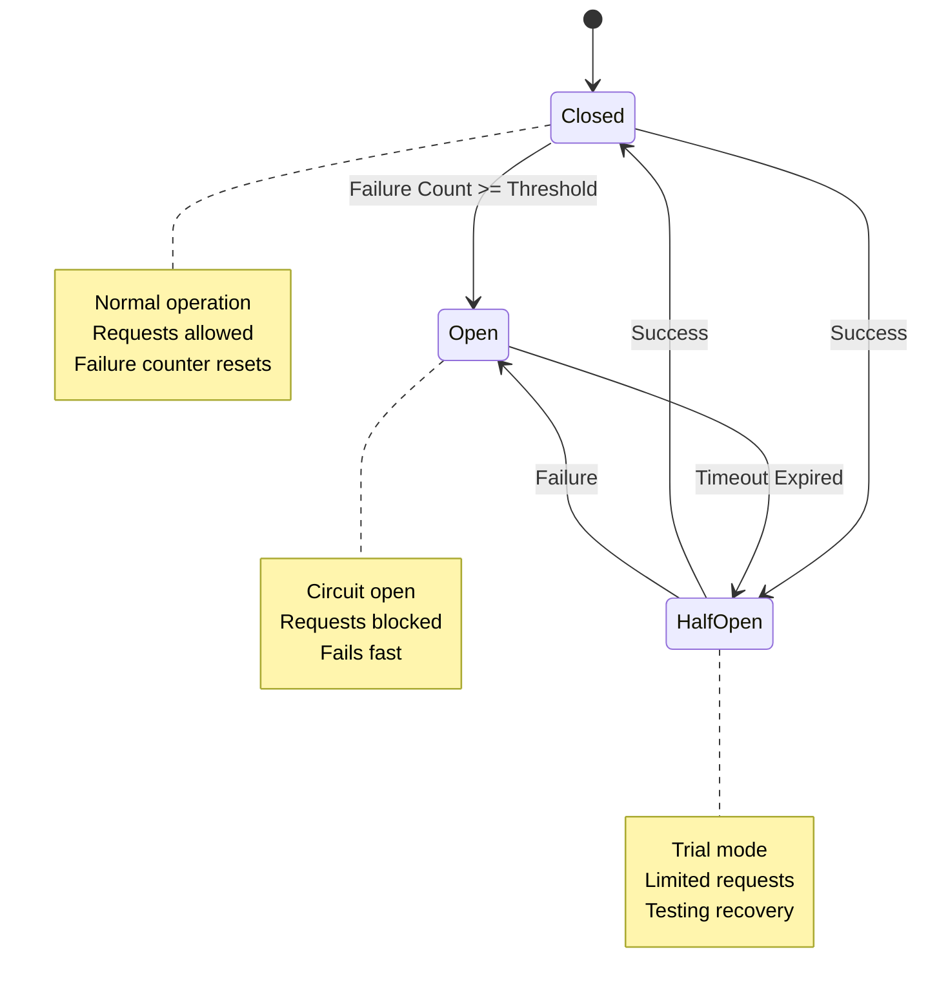
```mermaid
stateDiagram-v2
    [*] --> Closed
    Closed --> Open: Failure Count >= Threshold
    Closed --> HalfOpen: Success
    Open --> HalfOpen: Timeout Expired
    HalfOpen --> Closed: Success
    HalfOpen --> Open: Failure

    note right of Closed
        Normal operation
        Requests allowed
        Failure counter resets
    end note

    note right of Open
        Circuit open
        Requests blocked
        Fails fast
    end note

    note right of HalfOpen
        Trial mode
        Limited requests
        Testing recovery
    end note
```

## Configuration Patterns

### 13. Configuration Validation Flow

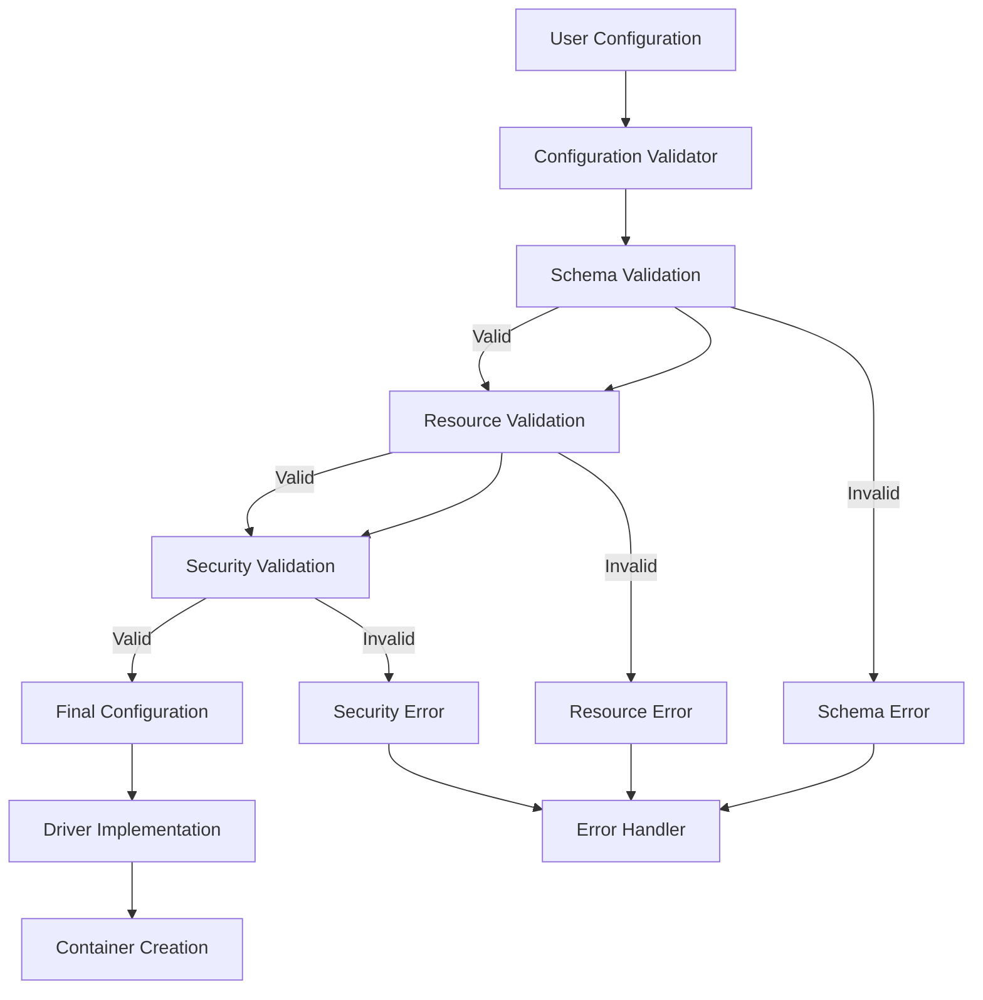
```mermaid
graph TB
    UserConfig[User Configuration] --> Validator[Configuration Validator]
    Validator --> SchemaCheck[Schema Validation]
    SchemaCheck --> ResourceCheck[Resource Validation]
    ResourceCheck --> SecurityCheck[Security Validation]

    SchemaCheck -->|Invalid| SchemaError[Schema Error]
    ResourceCheck -->|Invalid| ResourceError[Resource Error]
    SecurityCheck -->|Invalid| SecurityError[Security Error]

    SchemaCheck -->|Valid| ResourceCheck
    ResourceCheck -->|Valid| SecurityCheck
    SecurityCheck -->|Valid| FinalConfig[Final Configuration]

    FinalConfig --> Driver[Driver Implementation]
    Driver --> Container[Container Creation]

    SchemaError --> ErrorHandler[Error Handler]
    ResourceError --> ErrorHandler
    SecurityError --> ErrorHandler
```

### 14. Driver Selection Pattern

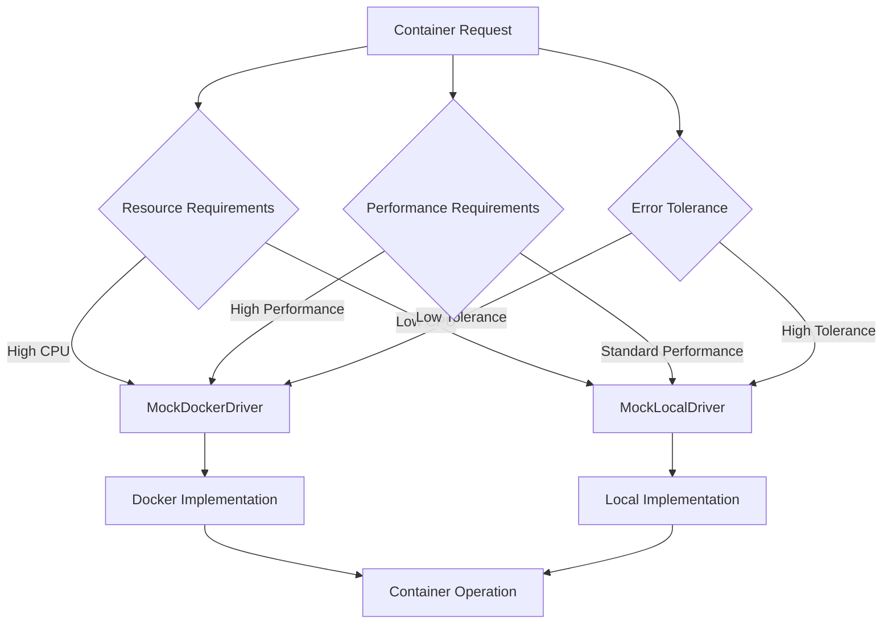
```mermaid
flowchart TD
    A[Container Request] --> B{Resource Requirements}
    B -->|High CPU| C[MockDockerDriver]
    B -->|Low CPU| D[MockLocalDriver]

    A --> E{Performance Requirements}
    E -->|High Performance| C
    E -->|Standard Performance| D

    A --> F{Error Tolerance}
    F -->|High Tolerance| D
    F -->|Low Tolerance| C

    C --> G[Docker Implementation]
    D --> H[Local Implementation]

    G --> Container[Container Operation]
    H --> Container
```

## Testing Patterns

### 15. Test Organization Pattern

```mermaid
graph TB
    TestSuite[Test Suite] --> UnitTests[Unit Tests]
    TestSuite --> IntegrationTests[Integration Tests]
    TestSuite --> PerformanceTests[Performance Tests]

    UnitTests --> InterfaceTests[Interface Tests]
    UnitTests --> ErrorTests[Error Tests]
    UnitTests --> TypeTests[Type Tests]

    IntegrationTests --> LifecycleTests[Lifecycle Tests]
    IntegrationTests --> MultiContainerTests[Multi-Container Tests]
    IntegrationTests --> CrossDriverTests[Cross-Driver Tests]

    PerformanceTests --> TimingTests[Timing Tests]
    PerformanceTests --> ResourceTests[Resource Tests]
    PerformanceTests -> LoadTests[Load Tests]

    InterfaceTests --> MockDocker[MockDockerDriver]
    InterfaceTests --> MockLocal[MockLocalDriver]

    ErrorTests --> ErrorHierarchy[Error Hierarchy]
    ErrorTests --> RetryLogic[Retry Logic]

    TypeTests --> SchemaValidation[Schema Validation]
    TypeTests --> TypeInference[Type Inference]
```

### 16. Mock Driver Testing Pattern

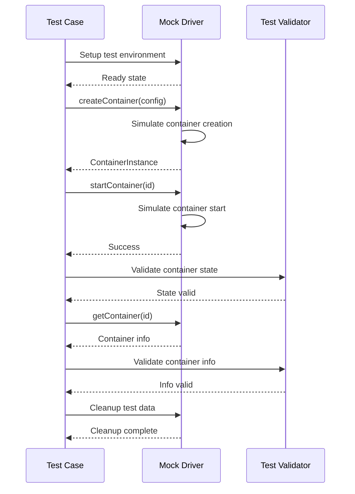
```mermaid
sequenceDiagram
    participant Test as Test Case
    participant Mock as Mock Driver
    participant Validator as Test Validator

    Test->>Mock: Setup test environment
    Mock-->>Test: Ready state

    Test->>Mock: createContainer(config)
    Mock->>Mock: Simulate container creation
    Mock-->>Test: ContainerInstance

    Test->>Mock: startContainer(id)
    Mock->>Mock: Simulate container start
    Mock-->>Test: Success

    Test->>Validator: Validate container state
    Validator-->>Test: State valid

    Test->>Mock: getContainer(id)
    Mock-->>Test: Container info
    Test->>Validator: Validate container info
    Validator-->>Test: Info valid

    Test->>Mock: Cleanup test data
    Mock-->>Test: Cleanup complete
```

## Integration Patterns

### 17. OpenAgent Integration Pattern

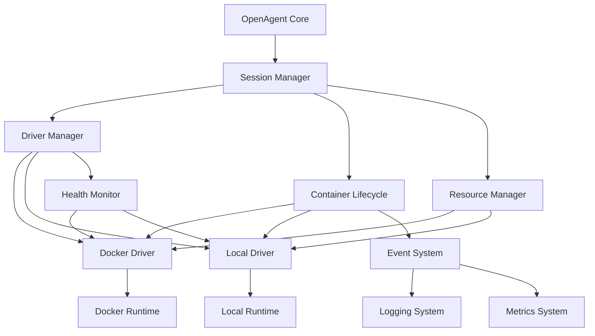
```mermaid
graph TB
    OpenAgent[OpenAgent Core] --> SessionManager[Session Manager]
    SessionManager --> DriverManager[Driver Manager]

    DriverManager --> DockerDriver[Docker Driver]
    DriverManager --> LocalDriver[Local Driver]

    SessionManager --> ContainerLifecycle[Container Lifecycle]
    ContainerLifecycle --> DockerDriver
    ContainerLifecycle --> LocalDriver

    DriverManager --> HealthMonitor[Health Monitor]
    HealthMonitor --> DockerDriver
    HealthMonitor --> LocalDriver

    SessionManager --> ResourceManager[Resource Manager]
    ResourceManager --> DockerDriver
    ResourceManager --> LocalDriver

    ContainerLifecycle --> Events[Event System]
    Events --> Logger[Logging System]
    Events --> Metrics[Metrics System]

    DockerDriver --> Runtime1[Docker Runtime]
    LocalDriver --> Runtime2[Local Runtime]
```

### 18. Multi-Tenancy Pattern

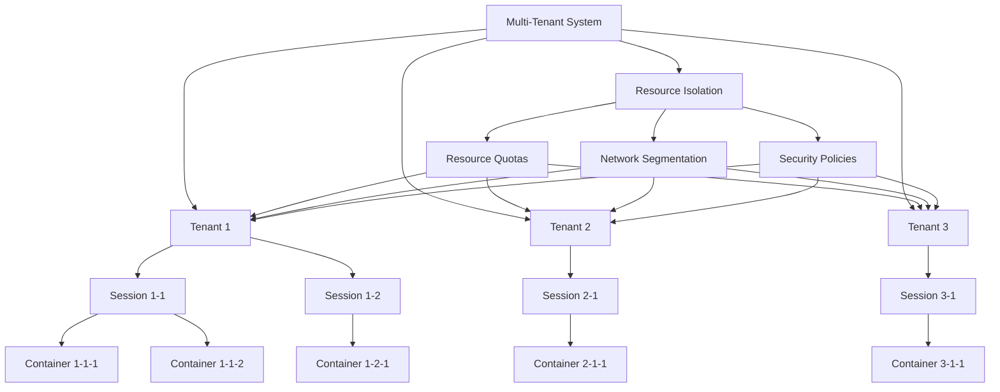
```mermaid
graph TB
    MultiTenant[Multi-Tenant System] --> Tenant1[Tenant 1]
    MultiTenant --> Tenant2[Tenant 2]
    MultiTenant --> Tenant3[Tenant 3]

    Tenant1 --> Session1[Session 1-1]
    Tenant1 --> Session2[Session 1-2]
    Tenant2 --> Session3[Session 2-1]
    Tenant3 --> Session4[Session 3-1]

    Session1 --> Container1-1[Container 1-1-1]
    Session1 --> Container1-2[Container 1-1-2]
    Session2 --> Container2-1[Container 1-2-1]
    Session3 --> Container3-1[Container 2-1-1]
    Session4 --> Container4-1[Container 3-1-1]

    MultiTenant --> Isolation[Resource Isolation]
    Isolation --> Quotas[Resource Quotas]
    Isolation --> Networks[Network Segmentation]
    Isolation --> Security[Security Policies]

    Quotas --> Tenant1
    Quotas --> Tenant2
    Quotas --> Tenant3

    Networks --> Tenant1
    Networks --> Tenant2
    Networks --> Tenant3

    Security --> Tenant1
    Security --> Tenant2
    Security --> Tenant3
```

## Summary

The Driver Interface package supports various usage patterns:

1. **Basic Container Management**: Simple create, start, stop, remove operations
2. **Configuration Management**: Fluent configuration builders with validation
3. **Error Handling**: Comprehensive error handling with retry logic
4. **Multi-Container Orchestration**: Complex multi-container scenarios
5. **Session-Based Management**: Session lifecycle and cleanup
6. **Resource Pooling**: Efficient resource allocation and deallocation
7. **Event-Driven Architecture**: Reactive patterns for container events
8. **Cross-Driver Operations**: Consistent behavior across different drivers
9. **Health Monitoring**: Proactive health checking and alerting
10. **Metrics Collection**: Comprehensive metrics and observability
11. **Testing Support**: Mock implementations for testing
12. **Integration Patterns**: Seamless integration with larger systems

These patterns provide developers with flexible, robust, and maintainable ways to manage containers using the Driver Interface package.